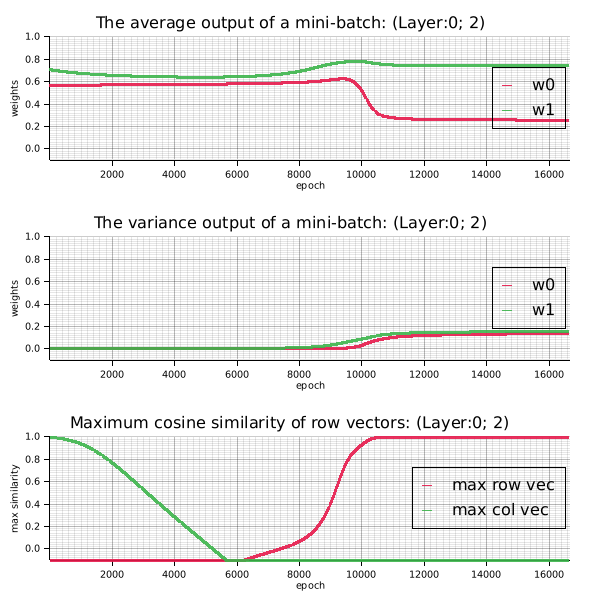
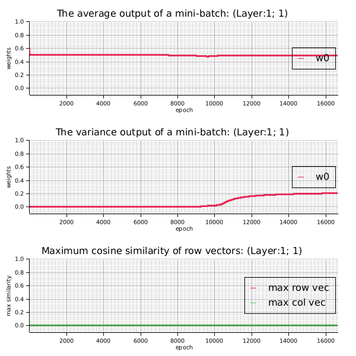

= XOR Regression Example

.References
* https://docs.rs/rand/latest/rand/[rand - Rust^]
* https://docs.rs/rand_distr/latest/rand_distr/[rand_distr - Rust^]
* https://docs.rs/ndarray/latest/ndarray/[ndarray - Rust^]
* https://docs.rs/linfa/latest/linfa/[linfa - Rust^]
* https://docs.rs/linfa-linear/latest/linfa_linear/[linfa_linear - Rust^]
* https://docs.rs/tracing/latest/tracing/index.html[tracing - Rust^]

== Running the Example 1

Learning and inference are performed by extending it to a continuous XOR function.
Note that by adding cross terms to the input, the model is realized as a single-layer neural network.

[source,math]
----
y = w_0 + w_1*x_1 + w_2*x_2 + w_3(x_1*x_2)
----

[source,shell]
.Run the example 1
----
cargo run --bin xor_reg1 --release
----

[source,plaintext]
.Results
----
== XOR Predictions ==
Input: [0.0, 0.0, 0.0] => Predicted: -0.000
Input: [0.0, 1.0, 0.0] => Predicted: 1.000
Input: [1.0, 0.0, 0.0] => Predicted: 1.000
Input: [1.0, 1.0, 1.0] => Predicted: -0.000
----

.Output png image for example 1
image::./images/xor_reg1.gif[]

== Running the Example 2

== Running the Example 3: Scratch

=== Sigmoid: OK 1: 100%

[source,shell]
----
cargo run --bin xor_reg_scratch --release -- --max-epoch=200000
----

image::images/xor_reg_scratch_L02_sigmoid_PASS01.gif[]

[source,json]
----
{"timestamp":"2026-01-22T13:20:35.075729Z","level":"INFO","fields":{"event":"Verifying orthogonality of weight matrices for training","layer_no":0,"cosine_similarity":-0.9947062925437565},"target":"xor_reg_scratch"}
{"timestamp":"2026-01-22T13:20:35.075775Z","level":"INFO","fields":{"event":"Initial layer configuration","layer_no":0,"weight":"[[-0.1918647009133636, -0.21550881043379988], [0.3230643956642183, 0.44826633094350155]]","bias":"[[0.5], [0.5]]","activation":"Sigmoid","cosine_similarity":0},"target":"xor_reg_scratch"}
{"timestamp":"2026-01-22T13:20:35.075783Z","level":"INFO","fields":{"event":"Initial layer configuration","layer_no":1,"weight":"[[0.3467364559512345, -0.22259618536865267]]","bias":"[[0.397775402601404]]","activation":"Sigmoid"},"target":"xor_reg_scratch"}
{"timestamp":"2026-01-22T13:20:35.075786Z","level":"INFO","fields":{"event":"Training configuration","max_epoch":200000,"mini_batch_size":4,"max_iteration":200000,"learning_rate":0.5},"target":"xor_reg_scratch"}
{"timestamp":"2026-01-22T13:20:35.075789Z","level":"INFO","fields":{"event":"Show layer information","layers":2,"hidden_activation":"Sigmoid","output_activation":"Sigmoid"},"target":"xor_reg_scratch"}
{"timestamp":"2026-01-22T13:20:35.076792Z","level":"INFO","fields":{"epoch":1,"loss":0.2618487647277515,"weight":", layer[0]={weight: [[-0.1924, -0.2161], [0.3232, 0.4484]], shape=[2, 2], strides=[2, 1], layout=Cc (0x5), const ndim=2, bias: [[0.4989], [0.5006]], shape=[2, 1], strides=[1, 1], layout=CFcf (0xf), const ndim=2, activation: Sigmoid}, delta[0]=[[0.0085], [-0.0045]], layer[1]={weight: [[0.3394, -0.2315]], shape=[1, 2], strides=[2, 1], layout=CFcf (0xf), const ndim=2, bias: [[0.3849]], shape=[1, 1], strides=[1, 1], layout=CFcf (0xf), const ndim=2, activation: Sigmoid}, delta[1]=[[0.1029]]"},"target":"xor_reg_scratch"}
{"timestamp":"2026-01-22T13:20:35.081308Z","level":"INFO","fields":{"epoch":1000,"loss":0.25007053698018755,"weight":", layer[0]={weight: [[-0.2066, -0.2240], [0.1493, 0.3312]], shape=[2, 2], strides=[2, 1], layout=Cc (0x5), const ndim=2, bias: [[0.4969], [0.4967]], shape=[2, 1], strides=[1, 1], layout=CFcf (0xf), const ndim=2, activation: Sigmoid}, delta[0]=[[-0.0001], [0.0001]], layer[1]={weight: [[0.1736, -0.2874]], shape=[1, 2], strides=[2, 1], layout=CFcf (0xf), const ndim=2, bias: [[0.0965]], shape=[1, 1], strides=[1, 1], layout=CFcf (0xf), const ndim=2, activation: Sigmoid}, delta[1]=[[0.0003]]"},"target":"xor_reg_scratch"}
{"timestamp":"2026-01-22T13:20:35.088405Z","level":"INFO","fields":{"epoch":2000,"loss":0.2500091819616818,"weight":", layer[0]={weight: [[-0.2156, -0.2274], [0.0459, 0.2864]], shape=[2, 2], strides=[2, 1], layout=Cc (0x5), const ndim=2, bias: [[0.5106], [0.4907]], shape=[2, 1], strides=[1, 1], layout=CFcf (0xf), const ndim=2, activation: Sigmoid}, delta[0]=[[-0.0001], [0.0000]], layer[1]={weight: [[0.1675, -0.2534]], shape=[1, 2], strides=[2, 1], layout=CFcf (0xf), const ndim=2, bias: [[0.0716]], shape=[1, 1], strides=[1, 1], layout=CFcf (0xf), const ndim=2, activation: Sigmoid}, delta[1]=[[0.0001]]"},"target":"xor_reg_scratch"}
{"timestamp":"2026-01-22T13:20:35.094340Z","level":"INFO","fields":{"epoch":3000,"loss":0.24998135674864053,"weight":", layer[0]={weight: [[-0.2263, -0.2322], [-0.0322, 0.2743]], shape=[2, 2], strides=[2, 1], layout=Cc (0x5), const ndim=2, bias: [[0.5259], [0.4918]], shape=[2, 1], strides=[1, 1], layout=CFcf (0xf), const ndim=2, activation: Sigmoid}, delta[0]=[[-0.0001], [-0.0000]], layer[1]={weight: [[0.1740, -0.2464]], shape=[1, 2], strides=[2, 1], layout=CFcf (0xf), const ndim=2, bias: [[0.0602]], shape=[1, 1], strides=[1, 1], layout=CFcf (0xf), const ndim=2, activation: Sigmoid}, delta[1]=[[0.0001]]"},"target":"xor_reg_scratch"}
{"timestamp":"2026-01-22T13:20:35.101783Z","level":"INFO","fields":{"epoch":4000,"loss":0.24995720733515664,"weight":", layer[0]={weight: [[-0.2392, -0.2379], [-0.1030, 0.2836]], shape=[2, 2], strides=[2, 1], layout=Cc (0x5), const ndim=2, bias: [[0.5435], [0.4992]], shape=[2, 1], strides=[1, 1], layout=CFcf (0xf), const ndim=2, activation: Sigmoid}, delta[0]=[[-0.0002], [-0.0001]], layer[1]={weight: [[0.1881, -0.2561]], shape=[1, 2], strides=[2, 1], layout=CFcf (0xf), const ndim=2, bias: [[0.0564]], shape=[1, 1], strides=[1, 1], layout=CFcf (0xf), const ndim=2, activation: Sigmoid}, delta[1]=[[0.0000]]"},"target":"xor_reg_scratch"}
{"timestamp":"2026-01-22T13:20:35.106131Z","level":"INFO","fields":{"epoch":5000,"loss":0.24992280511408915,"weight":", layer[0]={weight: [[-0.2548, -0.2442], [-0.1769, 0.3147]], shape=[2, 2], strides=[2, 1], layout=Cc (0x5), const ndim=2, bias: [[0.5648], [0.5153]], shape=[2, 1], strides=[1, 1], layout=CFcf (0xf), const ndim=2, activation: Sigmoid}, delta[0]=[[-0.0002], [-0.0002]], layer[1]={weight: [[0.2091, -0.2812]], shape=[1, 2], strides=[2, 1], layout=CFcf (0xf), const ndim=2, bias: [[0.0592]], shape=[1, 1], strides=[1, 1], layout=CFcf (0xf), const ndim=2, activation: Sigmoid}, delta[1]=[[-0.0001]]"},"target":"xor_reg_scratch"}
{"timestamp":"2026-01-22T13:20:35.111178Z","level":"INFO","fields":{"epoch":6000,"loss":0.24985361830646405,"weight":", layer[0]={weight: [[-0.2747, -0.2503], [-0.2653, 0.3772]], shape=[2, 2], strides=[2, 1], layout=Cc (0x5), const ndim=2, bias: [[0.5915], [0.5471]], shape=[2, 1], strides=[1, 1], layout=CFcf (0xf), const ndim=2, activation: Sigmoid}, delta[0]=[[-0.0002], [-0.0004]], layer[1]={weight: [[0.2386, -0.3270]], shape=[1, 2], strides=[2, 1], layout=CFcf (0xf), const ndim=2, bias: [[0.0715]], shape=[1, 1], strides=[1, 1], layout=CFcf (0xf), const ndim=2, activation: Sigmoid}, delta[1]=[[-0.0002]]"},"target":"xor_reg_scratch"}
{"timestamp":"2026-01-22T13:20:35.116150Z","level":"INFO","fields":{"epoch":7000,"loss":0.24965599612955108,"weight":", layer[0]={weight: [[-0.3021, -0.2539], [-0.3917, 0.5007]], shape=[2, 2], strides=[2, 1], layout=Cc (0x5), const ndim=2, bias: [[0.6267], [0.6144]], shape=[2, 1], strides=[1, 1], layout=CFcf (0xf), const ndim=2, activation: Sigmoid}, delta[0]=[[-0.0003], [-0.0008]], layer[1]={weight: [[0.2829, -0.4115]], shape=[1, 2], strides=[2, 1], layout=CFcf (0xf), const ndim=2, bias: [[0.1032]], shape=[1, 1], strides=[1, 1], layout=CFcf (0xf), const ndim=2, activation: Sigmoid}, delta[1]=[[-0.0004]]"},"target":"xor_reg_scratch"}
{"timestamp":"2026-01-22T13:20:35.120829Z","level":"INFO","fields":{"epoch":8000,"loss":0.24866966235553395,"weight":", layer[0]={weight: [[-0.3464, -0.2443], [-0.6369, 0.7898]], shape=[2, 2], strides=[2, 1], layout=Cc (0x5), const ndim=2, bias: [[0.6786], [0.7833]], shape=[2, 1], strides=[1, 1], layout=CFcf (0xf), const ndim=2, activation: Sigmoid}, delta[0]=[[-0.0005], [-0.0022]], layer[1]={weight: [[0.3672, -0.6040]], shape=[1, 2], strides=[2, 1], layout=CFcf (0xf), const ndim=2, bias: [[0.1937]], shape=[1, 1], strides=[1, 1], layout=CFcf (0xf), const ndim=2, activation: Sigmoid}, delta[1]=[[-0.0013]]"},"target":"xor_reg_scratch"}
{"timestamp":"2026-01-22T13:20:35.125827Z","level":"INFO","fields":{"epoch":9000,"loss":0.23713447058799664,"weight":", layer[0]={weight: [[-0.4663, -0.1398], [-1.4519, 1.7210]], shape=[2, 2], strides=[2, 1], layout=Cc (0x5), const ndim=2, bias: [[0.7800], [1.3007]], shape=[2, 1], strides=[1, 1], layout=CFcf (0xf), const ndim=2, activation: Sigmoid}, delta[0]=[[-0.0012], [-0.0068]], layer[1]={weight: [[0.6434, -1.2951]], shape=[1, 2], strides=[2, 1], layout=CFcf (0xf), const ndim=2, bias: [[0.5474]], shape=[1, 1], strides=[1, 1], layout=CFcf (0xf), const ndim=2, activation: Sigmoid}, delta[1]=[[-0.0052]]"},"target":"xor_reg_scratch"}
{"timestamp":"2026-01-22T13:20:35.131469Z","level":"INFO","fields":{"epoch":10000,"loss":0.17164545332462056,"weight":", layer[0]={weight: [[-1.3618, 0.6384], [-3.3606, 3.6161]], shape=[2, 2], strides=[2, 1], layout=Cc (0x5), const ndim=2, bias: [[0.4715], [2.3934]], shape=[2, 1], strides=[1, 1], layout=CFcf (0xf), const ndim=2, activation: Sigmoid}, delta[0]=[[0.0142], [-0.0078]], layer[1]={weight: [[1.9198, -3.0576]], shape=[1, 2], strides=[2, 1], layout=CFcf (0xf), const ndim=2, bias: [[1.3404]], shape=[1, 1], strides=[1, 1], layout=CFcf (0xf), const ndim=2, activation: Sigmoid}, delta[1]=[[-0.0074]]"},"target":"xor_reg_scratch"}
{"timestamp":"2026-01-22T13:20:35.137407Z","level":"INFO","fields":{"epoch":11000,"loss":0.026432230904370472,"weight":", layer[0]={weight: [[-3.5011, 3.1418], [-4.8170, 4.7450]], shape=[2, 2], strides=[2, 1], layout=Cc (0x5), const ndim=2, bias: [[-1.6254], [2.8009]], shape=[2, 1], strides=[1, 1], layout=CFcf (0xf), const ndim=2, activation: Sigmoid}, delta[0]=[[0.0065], [-0.0008]], layer[1]={weight: [[5.1823, -4.9540]], shape=[1, 2], strides=[2, 1], layout=CFcf (0xf), const ndim=2, bias: [[2.2369]], shape=[1, 1], strides=[1, 1], layout=CFcf (0xf), const ndim=2, activation: Sigmoid}, delta[1]=[[-0.0047]]"},"target":"xor_reg_scratch"}
{"timestamp":"2026-01-22T13:20:35.143182Z","level":"INFO","fields":{"epoch":12000,"loss":0.009400290013402778,"weight":", layer[0]={weight: [[-4.1720, 3.8629], [-5.2424, 5.1530]], shape=[2, 2], strides=[2, 1], layout=Cc (0x5), const ndim=2, bias: [[-2.0707], [2.8760]], shape=[2, 1], strides=[1, 1], layout=CFcf (0xf), const ndim=2, activation: Sigmoid}, delta[0]=[[0.0020], [-0.0005]], layer[1]={weight: [[6.3513, -5.8974]], shape=[1, 2], strides=[2, 1], layout=CFcf (0xf), const ndim=2, bias: [[2.6633]], shape=[1, 1], strides=[1, 1], layout=CFcf (0xf), const ndim=2, activation: Sigmoid}, delta[1]=[[-0.0025]]"},"target":"xor_reg_scratch"}
{"timestamp":"2026-01-22T13:20:35.148488Z","level":"INFO","fields":{"epoch":13000,"loss":0.005410084125633219,"weight":", layer[0]={weight: [[-4.4765, 4.1810], [-5.4451, 5.3666]], shape=[2, 2], strides=[2, 1], layout=Cc (0x5), const ndim=2, bias: [[-2.2549], [2.9257]], shape=[2, 1], strides=[1, 1], layout=CFcf (0xf), const ndim=2, activation: Sigmoid}, delta[0]=[[0.0011], [-0.0003]], layer[1]={weight: [[6.9218, -6.4169]], shape=[1, 2], strides=[2, 1], layout=CFcf (0xf), const ndim=2, bias: [[2.9137]], shape=[1, 1], strides=[1, 1], layout=CFcf (0xf), const ndim=2, activation: Sigmoid}, delta[1]=[[-0.0016]]"},"target":"xor_reg_scratch"}
{"timestamp":"2026-01-22T13:20:35.153108Z","level":"INFO","fields":{"epoch":14000,"loss":0.003729714102151226,"weight":", layer[0]={weight: [[-4.6650, 4.3771], [-5.5743, 5.5073]], shape=[2, 2], strides=[2, 1], layout=Cc (0x5), const ndim=2, bias: [[-2.3650], [2.9626]], shape=[2, 1], strides=[1, 1], layout=CFcf (0xf), const ndim=2, activation: Sigmoid}, delta[0]=[[0.0007], [-0.0003]], layer[1]={weight: [[7.2923, -6.7693]], shape=[1, 2], strides=[2, 1], layout=CFcf (0xf), const ndim=2, bias: [[3.0872]], shape=[1, 1], strides=[1, 1], layout=CFcf (0xf), const ndim=2, activation: Sigmoid}, delta[1]=[[-0.0012]]"},"target":"xor_reg_scratch"}
{"timestamp":"2026-01-22T13:20:35.157729Z","level":"INFO","fields":{"epoch":15000,"loss":0.0028217516192594674,"weight":", layer[0]={weight: [[-4.7991, 4.5164], [-5.6679, 5.6108]], shape=[2, 2], strides=[2, 1], layout=Cc (0x5), const ndim=2, bias: [[-2.4417], [2.9918]], shape=[2, 1], strides=[1, 1], layout=CFcf (0xf), const ndim=2, activation: Sigmoid}, delta[0]=[[0.0005], [-0.0002]], layer[1]={weight: [[7.5648, -7.0344]], shape=[1, 2], strides=[2, 1], layout=CFcf (0xf), const ndim=2, bias: [[3.2192]], shape=[1, 1], strides=[1, 1], layout=CFcf (0xf), const ndim=2, activation: Sigmoid}, delta[1]=[[-0.0009]]"},"target":"xor_reg_scratch"}
{"timestamp":"2026-01-22T13:20:35.162279Z","level":"INFO","fields":{"epoch":16000,"loss":0.002258569089413928,"weight":", layer[0]={weight: [[-4.9020, 4.6233], [-5.7408, 5.6921]], shape=[2, 2], strides=[2, 1], layout=Cc (0x5), const ndim=2, bias: [[-2.4998], [3.0158]], shape=[2, 1], strides=[1, 1], layout=CFcf (0xf), const ndim=2, activation: Sigmoid}, delta[0]=[[0.0004], [-0.0002]], layer[1]={weight: [[7.7797, -7.2463]], shape=[1, 2], strides=[2, 1], layout=CFcf (0xf), const ndim=2, bias: [[3.3253]], shape=[1, 1], strides=[1, 1], layout=CFcf (0xf), const ndim=2, activation: Sigmoid}, delta[1]=[[-0.0008]]"},"target":"xor_reg_scratch"}
{"timestamp":"2026-01-22T13:20:35.165984Z","level":"INFO","fields":{"event":"Stop the iterations early because the error is below the target value","epoch":16639,"loss":0.0019997066879274866},"target":"xor_reg_scratch"}
{"timestamp":"2026-01-22T13:20:35.166039Z","level":"INFO","fields":{"event":"Results","layers":2,"mini_batch_size":4,"last_epoch":16639,"learning_rate":0.5,"hidden_activation":"Sigmoid","output_activation":"Sigmoid","elapsed_time":0,"sec_per_epoch":0.0},"target":"xor_reg_scratch"}
{"timestamp":"2026-01-22T13:20:35.166056Z","level":"INFO","fields":{"event":"Weights and biases after the training process","layer_no":0,"weight":"[[-4.9569, 4.6803], [-5.7801, 5.7361]], shape=[2, 2], strides=[2, 1], layout=Cc (0x5), const ndim=2","bias":"[[-2.5305], [3.0292]], shape=[2, 1], strides=[1, 1], layout=CFcf (0xf), const ndim=2"},"target":"xor_reg_scratch"}
{"timestamp":"2026-01-22T13:20:35.166063Z","level":"INFO","fields":{"event":"Weights and biases after the training process","layer_no":1,"weight":"[[7.8964, -7.3621]], shape=[1, 2], strides=[2, 1], layout=CFcf (0xf), const ndim=2","bias":"[[3.3835]], shape=[1, 1], strides=[1, 1], layout=CFcf (0xf), const ndim=2"},"target":"xor_reg_scratch"}
{"timestamp":"2026-01-22T13:20:35.166072Z","level":"INFO","fields":{"event":"XOR predictions","inputs":"[0, 0]","predicted":"0.0449","answer":"0","error":"0.0000"},"target":"xor_reg_scratch"}
{"timestamp":"2026-01-22T13:20:35.166077Z","level":"INFO","fields":{"event":"XOR predictions","inputs":"[0, 1]","predicted":"0.9567","answer":"1","error":"1.0000"},"target":"xor_reg_scratch"}
{"timestamp":"2026-01-22T13:20:35.166081Z","level":"INFO","fields":{"event":"XOR predictions","inputs":"[1, 0]","predicted":"0.9501","answer":"1","error":"1.0000"},"target":"xor_reg_scratch"}
{"timestamp":"2026-01-22T13:20:35.166084Z","level":"INFO","fields":{"event":"XOR predictions","inputs":"[1, 1]","predicted":"0.0401","answer":"0","error":"0.0000"},"target":"xor_reg_scratch"}
{"timestamp":"2026-01-22T13:20:35.166089Z","level":"INFO","fields":{"accuracy":100.0,"rmse":0.03161760808312245,"layers":2,"learning_rate":0.5,"last_epoch":16639,"mini_batch_size":4,"hidden_activation":"Sigmoid","output_activation":"Sigmoid","cosine_similarities":"[\"-0.9947062925437565\"]"},"target":"xor_reg_scratch"}
{"timestamp":"2026-01-22T13:20:35.230068Z","level":"INFO","fields":{"message":"Saved the figure to: images/xor_reg_scratch_20260122_222035_ok_L02_sigmoid_00.png"},"target":"xor_reg_scratch"}
{"timestamp":"2026-01-22T13:20:35.236747Z","level":"INFO","fields":{"message":"Saved the figure to: images/xor_reg_scratch_20260122_222035_ok_L02_sigmoid_01.png"},"target":"xor_reg_scratch"}
{"timestamp":"2026-01-22T13:20:38.954941Z","level":"INFO","fields":{"message":"Saved the figure to: images/xor_reg_scratch_20260122_222035_ok_L02_sigmoid.gif"},"target":"xor_reg_scratch"}
----

=== Sigmoid: NG 1: 50%

[source,console]
----
$ cargo run --bin xor_reg_scratch --release -- --hidden-activation=sigmoid
learning_rate=0.5, n_samples=20000, mini_batch_size=4, hidden_activation=Sigmoid output_activation=Sigmoid
[00001]: loss=0.2512, delta[0]^T=[[0.0014, -0.0016]], delta[1]^T=[[0.0327]]
[01000]: loss=0.2500, delta[0]^T=[[-0.0000, 0.0000]], delta[1]^T=[[-0.0000]]
[02000]: loss=0.2500, delta[0]^T=[[-0.0000, -0.0000]], delta[1]^T=[[-0.0001]]
[03000]: loss=0.2500, delta[0]^T=[[0.0000, -0.0001]], delta[1]^T=[[-0.0002]]
[04000]: loss=0.2499, delta[0]^T=[[0.0000, -0.0002]], delta[1]^T=[[-0.0003]]
[05000]: loss=0.2498, delta[0]^T=[[0.0000, -0.0004]], delta[1]^T=[[-0.0004]]
[06000]: loss=0.2496, delta[0]^T=[[0.0001, -0.0009]], delta[1]^T=[[-0.0008]]
[07000]: loss=0.2485, delta[0]^T=[[0.0003, -0.0023]], delta[1]^T=[[-0.0021]]
[08000]: loss=0.2368, delta[0]^T=[[0.0009, -0.0063]], delta[1]^T=[[-0.0075]]
[09000]: loss=0.1883, delta[0]^T=[[-0.0029, -0.0072]], delta[1]^T=[[-0.0094]]
[10000]: loss=0.1520, delta[0]^T=[[-0.0033, -0.0025]], delta[1]^T=[[-0.0056]]
[11000]: loss=0.1378, delta[0]^T=[[-0.0011, -0.0010]], delta[1]^T=[[-0.0028]]
[12000]: loss=0.1328, delta[0]^T=[[-0.0006, -0.0006]], delta[1]^T=[[-0.0017]]
[13000]: loss=0.1304, delta[0]^T=[[-0.0004, -0.0004]], delta[1]^T=[[-0.0012]]
[14000]: loss=0.1291, delta[0]^T=[[-0.0003, -0.0003]], delta[1]^T=[[-0.0009]]
[15000]: loss=0.1283, delta[0]^T=[[-0.0002, -0.0002]], delta[1]^T=[[-0.0008]]
[16000]: loss=0.1278, delta[0]^T=[[-0.0002, -0.0002]], delta[1]^T=[[-0.0006]]
[17000]: loss=0.1274, delta[0]^T=[[-0.0001, -0.0001]], delta[1]^T=[[-0.0006]]
[18000]: loss=0.1271, delta[0]^T=[[-0.0001, -0.0001]], delta[1]^T=[[-0.0005]]
[19000]: loss=0.1268, delta[0]^T=[[-0.0001, -0.0001]], delta[1]^T=[[-0.0004]]
[20000]: loss=0.1266, delta[0]^T=[[-0.0001, -0.0001]], delta[1]^T=[[-0.0004]]
== Results ==
learning_rate=0.5, n_samples=20000, mini_batch_size=4, hidden_activation=Sigmoid, output_activation=Sigmoid, elapsed time=0.00[s] 0.0[s/sample]
== Trained ===
layer[0]=[[-3.1772, -7.0418],
 [-4.5524, 7.7691]]
layer[1]=[[-5.2230, -4.6518]]
Saved the figure to: images/xor_reg_scratch_00_mean.png
Saved the figure to: images/xor_reg_scratch_01_mean.png
Saved the figure to: images/xor_reg_scratch_00_var.png
Saved the figure to: images/xor_reg_scratch_01_var.png

== XOR Predictions ==
Input: [[0.0, 0.0]] => Predicted: 0.04, answer: 0, loss: 0.00
Input: [[0.0, 1.0]] => Predicted: 0.50, answer: 1, loss: 0.13
Input: [[1.0, 0.0]] => Predicted: 0.96, answer: 1, loss: 0.00
Input: [[1.0, 1.0]] => Predicted: 0.50, answer: 0, loss: 0.13
Accuracy: 50.00%
----

image::images/xor_reg_scratch_L02_sigmoid_FAIL01.gif[]

image::images/xor_reg_scratch_L02_sigmoid_FAIL01_00_mean.png[]

image::images/xor_reg_scratch_L02_sigmoid_FAIL01_00_var.png[]

image::images/xor_reg_scratch_L02_sigmoid_FAIL01_01_mean.png[]

image::images/xor_reg_scratch_L02_sigmoid_FAIL01_01_var.png[]

=== Sigmoid: 2 layers : NG 2: Accuracy 0%

The neural network is initialized with random values in the range (-0.5, 0.5). Unfortunately, the cosine similarity in this case is 0.77, which is close to 1 in absolute value. This is because the weight matrices are not orthogonal and the gradient vectors point in the same direction. As a result, the gradients are corrected in almost the same direction and do not converge.

[source,shell]
----
cargo run --bin xor_reg_scratch --release
----

image::images/xor_reg_scratch_L02_sigmoid_FAIL02_00.png[]

image::images/xor_reg_scratch_L02_sigmoid_FAIL02_01.png[]

image::images/xor_reg_scratch_L02_sigmoid_FAIL02.gif[]

[source,json]
----
{"timestamp":"2026-01-20T17:08:23.196549Z","level":"INFO","fields":{"event":"Verifying orthogonality of weight matrices for training","layer_no":0,"cosine_similarity":0.7720986653489417},"target":"xor_reg_scratch"}
{"timestamp":"2026-01-20T17:08:23.196585Z","level":"INFO","fields":{"event":"Initial layer configuration","layer_no":0,"weight":"[[-0.2882701462752115, -0.032079306376549654], [-0.21550640216510852, 0.14052656479674708]]","bias":"[[0.24777842474792466], [-0.07377868620874994]]","activation":"Sigmoid","cosine_similarity":0},"target":"xor_reg_scratch"}
{"timestamp":"2026-01-20T17:08:23.196592Z","level":"INFO","fields":{"event":"Initial layer configuration","layer_no":1,"weight":"[[0.4534746288924496, -0.07112448343220756]]","bias":"[[0.4064133359858315]]","activation":"Sigmoid"},"target":"xor_reg_scratch"}
{"timestamp":"2026-01-20T17:08:23.196595Z","level":"INFO","fields":{"event":"Training configuration","max_epoch":20000,"mini_batch_size":4,"max_iteration":20000,"learning_rate":0.5},"target":"xor_reg_scratch"}
{"timestamp":"2026-01-20T17:08:23.196598Z","level":"INFO","fields":{"event":"Show layer information","layers":2,"hidden_activation":"Sigmoid","output_activation":"Sigmoid"},"target":"xor_reg_scratch"}
{"timestamp":"2026-01-20T17:08:23.197724Z","level":"INFO","fields":{"epoch":1,"loss":0.27185325342496736,"weight":", layer[0]={weight: [[-0.2892, -0.0331], [-0.2154, 0.1407]], shape=[2, 2], strides=[2, 1], layout=Cc (0x5), const ndim=2, bias: [[0.2459], [-0.0735]], shape=[2, 1], strides=[1, 1], layout=CFcf (0xf), const ndim=2, activation: Sigmoid}, delta[0]=[[0.0151], [-0.0024]], layer[1]={weight: [[0.4447, -0.0791]], shape=[1, 2], strides=[2, 1], layout=CFcf (0xf), const ndim=2, bias: [[0.3896]], shape=[1, 1], strides=[1, 1], layout=CFcf (0xf), const ndim=2, activation: Sigmoid}, delta[1]=[[0.1349]]"},"target":"xor_reg_scratch"}
{"timestamp":"2026-01-20T17:08:23.202541Z","level":"INFO","fields":{"epoch":1000,"loss":0.25000542337670667,"weight":", layer[0]={weight: [[-0.3007, -0.0467], [-0.1971, 0.1422]], shape=[2, 2], strides=[2, 1], layout=Cc (0x5), const ndim=2, bias: [[0.2194], [-0.0426]], shape=[2, 1], strides=[1, 1], layout=CFcf (0xf), const ndim=2, activation: Sigmoid}, delta[0]=[[-0.0001], [-0.0001]], layer[1]={weight: [[0.2415, -0.2580]], shape=[1, 2], strides=[2, 1], layout=CFcf (0xf), const ndim=2, bias: [[0.0010]], shape=[1, 1], strides=[1, 1], layout=CFcf (0xf), const ndim=2, activation: Sigmoid}, delta[1]=[[0.0000]]"},"target":"xor_reg_scratch"}
{"timestamp":"2026-01-20T17:08:23.209135Z","level":"INFO","fields":{"epoch":2000,"loss":0.25000396778343925,"weight":", layer[0]={weight: [[-0.2960, -0.0451], [-0.1889, 0.1371]], shape=[2, 2], strides=[2, 1], layout=Cc (0x5), const ndim=2, bias: [[0.2257], [-0.0293]], shape=[2, 1], strides=[1, 1], layout=CFcf (0xf), const ndim=2, activation: Sigmoid}, delta[0]=[[-0.0000], [-0.0001]], layer[1]={weight: [[0.2385, -0.2537]], shape=[1, 2], strides=[2, 1], layout=CFcf (0xf), const ndim=2, bias: [[0.0008]], shape=[1, 1], strides=[1, 1], layout=CFcf (0xf), const ndim=2, activation: Sigmoid}, delta[1]=[[-0.0000]]"},"target":"xor_reg_scratch"}
{"timestamp":"2026-01-20T17:08:23.216659Z","level":"INFO","fields":{"epoch":3000,"loss":0.25000284260495503,"weight":", layer[0]={weight: [[-0.2916, -0.0449], [-0.1824, 0.1334]], shape=[2, 2], strides=[2, 1], layout=Cc (0x5), const ndim=2, bias: [[0.2318], [-0.0171]], shape=[2, 1], strides=[1, 1], layout=CFcf (0xf), const ndim=2, activation: Sigmoid}, delta[0]=[[-0.0000], [-0.0001]], layer[1]={weight: [[0.2359, -0.2504]], shape=[1, 2], strides=[2, 1], layout=CFcf (0xf), const ndim=2, bias: [[0.0010]], shape=[1, 1], strides=[1, 1], layout=CFcf (0xf), const ndim=2, activation: Sigmoid}, delta[1]=[[-0.0000]]"},"target":"xor_reg_scratch"}
{"timestamp":"2026-01-20T17:08:23.221660Z","level":"INFO","fields":{"epoch":4000,"loss":0.2500019152796076,"weight":", layer[0]={weight: [[-0.2873, -0.0459], [-0.1773, 0.1308]], shape=[2, 2], strides=[2, 1], layout=Cc (0x5), const ndim=2, bias: [[0.2378], [-0.0056]], shape=[2, 1], strides=[1, 1], layout=CFcf (0xf), const ndim=2, activation: Sigmoid}, delta[0]=[[-0.0000], [-0.0001]], layer[1]={weight: [[0.2335, -0.2479]], shape=[1, 2], strides=[2, 1], layout=CFcf (0xf), const ndim=2, bias: [[0.0013]], shape=[1, 1], strides=[1, 1], layout=CFcf (0xf), const ndim=2, activation: Sigmoid}, delta[1]=[[-0.0000]]"},"target":"xor_reg_scratch"}
{"timestamp":"2026-01-20T17:08:23.230581Z","level":"INFO","fields":{"epoch":5000,"loss":0.2500011065365049,"weight":", layer[0]={weight: [[-0.2833, -0.0476], [-0.1732, 0.1292]], shape=[2, 2], strides=[2, 1], layout=Cc (0x5), const ndim=2, bias: [[0.2439], [0.0053]], shape=[2, 1], strides=[1, 1], layout=CFcf (0xf), const ndim=2, activation: Sigmoid}, delta[0]=[[-0.0000], [-0.0001]], layer[1]={weight: [[0.2315, -0.2459]], shape=[1, 2], strides=[2, 1], layout=CFcf (0xf), const ndim=2, bias: [[0.0017]], shape=[1, 1], strides=[1, 1], layout=CFcf (0xf), const ndim=2, activation: Sigmoid}, delta[1]=[[-0.0000]]"},"target":"xor_reg_scratch"}
{"timestamp":"2026-01-20T17:08:23.235892Z","level":"INFO","fields":{"epoch":6000,"loss":0.2500003656454795,"weight":", layer[0]={weight: [[-0.2794, -0.0501], [-0.1700, 0.1284]], shape=[2, 2], strides=[2, 1], layout=Cc (0x5), const ndim=2, bias: [[0.2500], [0.0158]], shape=[2, 1], strides=[1, 1], layout=CFcf (0xf), const ndim=2, activation: Sigmoid}, delta[0]=[[-0.0001], [-0.0001]], layer[1]={weight: [[0.2298, -0.2444]], shape=[1, 2], strides=[2, 1], layout=CFcf (0xf), const ndim=2, bias: [[0.0021]], shape=[1, 1], strides=[1, 1], layout=CFcf (0xf), const ndim=2, activation: Sigmoid}, delta[1]=[[-0.0000]]"},"target":"xor_reg_scratch"}
{"timestamp":"2026-01-20T17:08:23.240571Z","level":"INFO","fields":{"epoch":7000,"loss":0.24999965749963313,"weight":", layer[0]={weight: [[-0.2758, -0.0530], [-0.1676, 0.1285]], shape=[2, 2], strides=[2, 1], layout=Cc (0x5), const ndim=2, bias: [[0.2564], [0.0260]], shape=[2, 1], strides=[1, 1], layout=CFcf (0xf), const ndim=2, activation: Sigmoid}, delta[0]=[[-0.0001], [-0.0001]], layer[1]={weight: [[0.2284, -0.2434]], shape=[1, 2], strides=[2, 1], layout=CFcf (0xf), const ndim=2, bias: [[0.0026]], shape=[1, 1], strides=[1, 1], layout=CFcf (0xf), const ndim=2, activation: Sigmoid}, delta[1]=[[-0.0000]]"},"target":"xor_reg_scratch"}
{"timestamp":"2026-01-20T17:08:23.244974Z","level":"INFO","fields":{"epoch":8000,"loss":0.24999895541874542,"weight":", layer[0]={weight: [[-0.2723, -0.0564], [-0.1658, 0.1294]], shape=[2, 2], strides=[2, 1], layout=Cc (0x5), const ndim=2, bias: [[0.2630], [0.0362]], shape=[2, 1], strides=[1, 1], layout=CFcf (0xf), const ndim=2, activation: Sigmoid}, delta[0]=[[-0.0001], [-0.0001]], layer[1]={weight: [[0.2274, -0.2426]], shape=[1, 2], strides=[2, 1], layout=CFcf (0xf), const ndim=2, bias: [[0.0031]], shape=[1, 1], strides=[1, 1], layout=CFcf (0xf), const ndim=2, activation: Sigmoid}, delta[1]=[[-0.0000]]"},"target":"xor_reg_scratch"}
{"timestamp":"2026-01-20T17:08:23.250612Z","level":"INFO","fields":{"epoch":9000,"loss":0.24999823679846833,"weight":", layer[0]={weight: [[-0.2691, -0.0601], [-0.1647, 0.1310]], shape=[2, 2], strides=[2, 1], layout=Cc (0x5), const ndim=2, bias: [[0.2700], [0.0463]], shape=[2, 1], strides=[1, 1], layout=CFcf (0xf), const ndim=2, activation: Sigmoid}, delta[0]=[[-0.0001], [-0.0001]], layer[1]={weight: [[0.2267, -0.2423]], shape=[1, 2], strides=[2, 1], layout=CFcf (0xf), const ndim=2, bias: [[0.0036]], shape=[1, 1], strides=[1, 1], layout=CFcf (0xf), const ndim=2, activation: Sigmoid}, delta[1]=[[-0.0000]]"},"target":"xor_reg_scratch"}
{"timestamp":"2026-01-20T17:08:23.255996Z","level":"INFO","fields":{"epoch":10000,"loss":0.2499974801461751,"weight":", layer[0]={weight: [[-0.2661, -0.0642], [-0.1643, 0.1334]], shape=[2, 2], strides=[2, 1], layout=Cc (0x5), const ndim=2, bias: [[0.2773], [0.0565]], shape=[2, 1], strides=[1, 1], layout=CFcf (0xf), const ndim=2, activation: Sigmoid}, delta[0]=[[-0.0001], [-0.0001]], layer[1]={weight: [[0.2264, -0.2422]], shape=[1, 2], strides=[2, 1], layout=CFcf (0xf), const ndim=2, bias: [[0.0041]], shape=[1, 1], strides=[1, 1], layout=CFcf (0xf), const ndim=2, activation: Sigmoid}, delta[1]=[[-0.0000]]"},"target":"xor_reg_scratch"}
{"timestamp":"2026-01-20T17:08:23.260614Z","level":"INFO","fields":{"epoch":11000,"loss":0.249996662679098,"weight":", layer[0]={weight: [[-0.2634, -0.0685], [-0.1644, 0.1366]], shape=[2, 2], strides=[2, 1], layout=Cc (0x5), const ndim=2, bias: [[0.2850], [0.0669]], shape=[2, 1], strides=[1, 1], layout=CFcf (0xf), const ndim=2, activation: Sigmoid}, delta[0]=[[-0.0001], [-0.0001]], layer[1]={weight: [[0.2265, -0.2425]], shape=[1, 2], strides=[2, 1], layout=CFcf (0xf), const ndim=2, bias: [[0.0045]], shape=[1, 1], strides=[1, 1], layout=CFcf (0xf), const ndim=2, activation: Sigmoid}, delta[1]=[[-0.0000]]"},"target":"xor_reg_scratch"}
{"timestamp":"2026-01-20T17:08:23.266080Z","level":"INFO","fields":{"epoch":12000,"loss":0.24999575792264161,"weight":", layer[0]={weight: [[-0.2610, -0.0731], [-0.1652, 0.1407]], shape=[2, 2], strides=[2, 1], layout=Cc (0x5), const ndim=2, bias: [[0.2931], [0.0776]], shape=[2, 1], strides=[1, 1], layout=CFcf (0xf), const ndim=2, activation: Sigmoid}, delta[0]=[[-0.0001], [-0.0001]], layer[1]={weight: [[0.2269, -0.2431]], shape=[1, 2], strides=[2, 1], layout=CFcf (0xf), const ndim=2, bias: [[0.0049]], shape=[1, 1], strides=[1, 1], layout=CFcf (0xf), const ndim=2, activation: Sigmoid}, delta[1]=[[-0.0000]]"},"target":"xor_reg_scratch"}
{"timestamp":"2026-01-20T17:08:23.271074Z","level":"INFO","fields":{"epoch":13000,"loss":0.24999473279339277,"weight":", layer[0]={weight: [[-0.2590, -0.0779], [-0.1666, 0.1458]], shape=[2, 2], strides=[2, 1], layout=Cc (0x5), const ndim=2, bias: [[0.3017], [0.0888]], shape=[2, 1], strides=[1, 1], layout=CFcf (0xf), const ndim=2, activation: Sigmoid}, delta[0]=[[-0.0001], [-0.0001]], layer[1]={weight: [[0.2278, -0.2441]], shape=[1, 2], strides=[2, 1], layout=CFcf (0xf), const ndim=2, bias: [[0.0053]], shape=[1, 1], strides=[1, 1], layout=CFcf (0xf), const ndim=2, activation: Sigmoid}, delta[1]=[[-0.0000]]"},"target":"xor_reg_scratch"}
{"timestamp":"2026-01-20T17:08:23.275591Z","level":"INFO","fields":{"epoch":14000,"loss":0.24999354351652608,"weight":", layer[0]={weight: [[-0.2573, -0.0828], [-0.1689, 0.1520]], shape=[2, 2], strides=[2, 1], layout=Cc (0x5), const ndim=2, bias: [[0.3108], [0.1006]], shape=[2, 1], strides=[1, 1], layout=CFcf (0xf), const ndim=2, activation: Sigmoid}, delta[0]=[[-0.0001], [-0.0001]], layer[1]={weight: [[0.2292, -0.2455]], shape=[1, 2], strides=[2, 1], layout=CFcf (0xf), const ndim=2, bias: [[0.0058]], shape=[1, 1], strides=[1, 1], layout=CFcf (0xf), const ndim=2, activation: Sigmoid}, delta[1]=[[-0.0000]]"},"target":"xor_reg_scratch"}
{"timestamp":"2026-01-20T17:08:23.280972Z","level":"INFO","fields":{"epoch":15000,"loss":0.24999212935042844,"weight":", layer[0]={weight: [[-0.2560, -0.0880], [-0.1720, 0.1594]], shape=[2, 2], strides=[2, 1], layout=Cc (0x5), const ndim=2, bias: [[0.3205], [0.1132]], shape=[2, 1], strides=[1, 1], layout=CFcf (0xf), const ndim=2, activation: Sigmoid}, delta[0]=[[-0.0001], [-0.0001]], layer[1]={weight: [[0.2311, -0.2474]], shape=[1, 2], strides=[2, 1], layout=CFcf (0xf), const ndim=2, bias: [[0.0062]], shape=[1, 1], strides=[1, 1], layout=CFcf (0xf), const ndim=2, activation: Sigmoid}, delta[1]=[[-0.0000]]"},"target":"xor_reg_scratch"}
{"timestamp":"2026-01-20T17:08:23.286120Z","level":"INFO","fields":{"epoch":16000,"loss":0.24999040227497232,"weight":", layer[0]={weight: [[-0.2552, -0.0934], [-0.1761, 0.1684]], shape=[2, 2], strides=[2, 1], layout=Cc (0x5), const ndim=2, bias: [[0.3308], [0.1268]], shape=[2, 1], strides=[1, 1], layout=CFcf (0xf), const ndim=2, activation: Sigmoid}, delta[0]=[[-0.0001], [-0.0001]], layer[1]={weight: [[0.2335, -0.2499]], shape=[1, 2], strides=[2, 1], layout=CFcf (0xf), const ndim=2, bias: [[0.0068]], shape=[1, 1], strides=[1, 1], layout=CFcf (0xf), const ndim=2, activation: Sigmoid}, delta[1]=[[-0.0000]]"},"target":"xor_reg_scratch"}
{"timestamp":"2026-01-20T17:08:23.290674Z","level":"INFO","fields":{"epoch":17000,"loss":0.24998822905517817,"weight":", layer[0]={weight: [[-0.2549, -0.0989], [-0.1815, 0.1792]], shape=[2, 2], strides=[2, 1], layout=Cc (0x5), const ndim=2, bias: [[0.3418], [0.1417]], shape=[2, 1], strides=[1, 1], layout=CFcf (0xf), const ndim=2, activation: Sigmoid}, delta[0]=[[-0.0001], [-0.0001]], layer[1]={weight: [[0.2366, -0.2532]], shape=[1, 2], strides=[2, 1], layout=CFcf (0xf), const ndim=2, bias: [[0.0074]], shape=[1, 1], strides=[1, 1], layout=CFcf (0xf), const ndim=2, activation: Sigmoid}, delta[1]=[[-0.0000]]"},"target":"xor_reg_scratch"}
{"timestamp":"2026-01-20T17:08:23.295392Z","level":"INFO","fields":{"epoch":18000,"loss":0.24998539820102791,"weight":", layer[0]={weight: [[-0.2553, -0.1046], [-0.1885, 0.1924]], shape=[2, 2], strides=[2, 1], layout=Cc (0x5), const ndim=2, bias: [[0.3537], [0.1584]], shape=[2, 1], strides=[1, 1], layout=CFcf (0xf), const ndim=2, activation: Sigmoid}, delta[0]=[[-0.0001], [-0.0001]], layer[1]={weight: [[0.2404, -0.2575]], shape=[1, 2], strides=[2, 1], layout=CFcf (0xf), const ndim=2, bias: [[0.0084]], shape=[1, 1], strides=[1, 1], layout=CFcf (0xf), const ndim=2, activation: Sigmoid}, delta[1]=[[-0.0000]]"},"target":"xor_reg_scratch"}
{"timestamp":"2026-01-20T17:08:23.300207Z","level":"INFO","fields":{"epoch":19000,"loss":0.2499815550732919,"weight":", layer[0]={weight: [[-0.2564, -0.1104], [-0.1976, 0.2086]], shape=[2, 2], strides=[2, 1], layout=Cc (0x5), const ndim=2, bias: [[0.3664], [0.1774]], shape=[2, 1], strides=[1, 1], layout=CFcf (0xf), const ndim=2, activation: Sigmoid}, delta[0]=[[-0.0001], [-0.0002]], layer[1]={weight: [[0.2451, -0.2631]], shape=[1, 2], strides=[2, 1], layout=CFcf (0xf), const ndim=2, bias: [[0.0098]], shape=[1, 1], strides=[1, 1], layout=CFcf (0xf), const ndim=2, activation: Sigmoid}, delta[1]=[[-0.0000]]"},"target":"xor_reg_scratch"}
{"timestamp":"2026-01-20T17:08:23.305336Z","level":"INFO","fields":{"epoch":20000,"loss":0.2499760643659967,"weight":", layer[0]={weight: [[-0.2584, -0.1163], [-0.2095, 0.2289]], shape=[2, 2], strides=[2, 1], layout=Cc (0x5), const ndim=2, bias: [[0.3802], [0.1995]], shape=[2, 1], strides=[1, 1], layout=CFcf (0xf), const ndim=2, activation: Sigmoid}, delta[0]=[[-0.0001], [-0.0002]], layer[1]={weight: [[0.2509, -0.2706]], shape=[1, 2], strides=[2, 1], layout=CFcf (0xf), const ndim=2, bias: [[0.0118]], shape=[1, 1], strides=[1, 1], layout=CFcf (0xf), const ndim=2, activation: Sigmoid}, delta[1]=[[-0.0000]]"},"target":"xor_reg_scratch"}
{"timestamp":"2026-01-20T17:08:23.305382Z","level":"INFO","fields":{"event":"Results","layers":2,"mini_batch_size":4,"last_epoch":20000,"learning_rate":0.5,"hidden_activation":"Sigmoid","output_activation":"Sigmoid","elapsed_time":0,"sec_per_epoch":0.0},"target":"xor_reg_scratch"}
{"timestamp":"2026-01-20T17:08:23.305392Z","level":"INFO","fields":{"event":"Weights and biases after the training process","layer_no":0,"weight":"[[-0.2584, -0.1163], [-0.2095, 0.2289]], shape=[2, 2], strides=[2, 1], layout=Cc (0x5), const ndim=2","bias":"[[0.3802], [0.1995]], shape=[2, 1], strides=[1, 1], layout=CFcf (0xf), const ndim=2"},"target":"xor_reg_scratch"}
{"timestamp":"2026-01-20T17:08:23.305397Z","level":"INFO","fields":{"event":"Weights and biases after the training process","layer_no":1,"weight":"[[0.2509, -0.2706]], shape=[1, 2], strides=[2, 1], layout=CFcf (0xf), const ndim=2","bias":"[[0.0118]], shape=[1, 1], strides=[1, 1], layout=CFcf (0xf), const ndim=2"},"target":"xor_reg_scratch"}
{"timestamp":"2026-01-20T17:08:23.305404Z","level":"INFO","fields":{"event":"XOR predictions","inputs":"[0, 0]","predicted":"0.5030","answer":"1","error":"0.0000"},"target":"xor_reg_scratch"}
{"timestamp":"2026-01-20T17:08:23.305409Z","level":"INFO","fields":{"event":"XOR predictions","inputs":"[0, 1]","predicted":"0.4975","answer":"0","error":"1.0000"},"target":"xor_reg_scratch"}
{"timestamp":"2026-01-20T17:08:23.305412Z","level":"INFO","fields":{"event":"XOR predictions","inputs":"[1, 0]","predicted":"0.5026","answer":"1","error":"1.0000"},"target":"xor_reg_scratch"}
{"timestamp":"2026-01-20T17:08:23.305415Z","level":"INFO","fields":{"event":"XOR predictions","inputs":"[1, 1]","predicted":"0.4969","answer":"0","error":"0.0000"},"target":"xor_reg_scratch"}
{"timestamp":"2026-01-20T17:08:23.305421Z","level":"INFO","fields":{"accuracy":0.0,"rmse":0.35353646043624615,"layers":2,"learning_rate":0.5,"last_epoch":20000,"mini_batch_size":4,"hidden_activation":"Sigmoid","output_activation":"Sigmoid","cosine_similarities":"[\"0.7720986653489417\"]"},"target":"xor_reg_scratch"}
{"timestamp":"2026-01-20T17:08:23.371295Z","level":"INFO","fields":{"message":"Saved the figure to: images/xor_reg_scratch_20260121_020823_ng_L02_sigmoid_00.png"},"target":"xor_reg_scratch"}
{"timestamp":"2026-01-20T17:08:23.378443Z","level":"INFO","fields":{"message":"Saved the figure to: images/xor_reg_scratch_20260121_020823_ng_L02_sigmoid_01.png"},"target":"xor_reg_scratch"}
{"timestamp":"2026-01-20T17:08:26.358747Z","level":"INFO","fields":{"message":"Saved the figure to: images/xor_reg_scratch_20260121_020823_ng_L02_sigmoid.gif"},"target":"xor_reg_scratch"}
----

=== ReLu: Success

[source,console]
----
$ cargo run --bin xor_reg_scratch --release -- --hidden-activation=relu
...snip...
learning_rate=0.5, n_samples=20000, mini_batch_size=4, hidden_activation=ReLU output_activation=Sigmoid
[00001]: loss=0.3975, delta[0]^T=[[-0.3872, -0.1282]], delta[1]^T=[[-1.4723]]
[01000]: loss=0.0000, delta[0]^T=[[0.0000, -0.0000]], delta[1]^T=[[0.0000]]
[02000]: loss=0.0000, delta[0]^T=[[0.0000, -0.0000]], delta[1]^T=[[-0.0000]]
[03000]: loss=0.0000, delta[0]^T=[[0.0000, -0.0000]], delta[1]^T=[[-0.0000]]
[04000]: loss=0.0000, delta[0]^T=[[0.0000, -0.0000]], delta[1]^T=[[0.0000]]
[05000]: loss=0.0000, delta[0]^T=[[0.0000, -0.0000]], delta[1]^T=[[-0.0000]]
[06000]: loss=0.0000, delta[0]^T=[[0.0000, -0.0000]], delta[1]^T=[[-0.0000]]
[07000]: loss=0.0000, delta[0]^T=[[0.0000, -0.0000]], delta[1]^T=[[-0.0000]]
[08000]: loss=0.0000, delta[0]^T=[[0.0000, -0.0000]], delta[1]^T=[[0.0000]]
[09000]: loss=0.0000, delta[0]^T=[[0.0000, -0.0000]], delta[1]^T=[[-0.0000]]
[10000]: loss=0.0000, delta[0]^T=[[0.0000, -0.0000]], delta[1]^T=[[-0.0000]]
[11000]: loss=0.0000, delta[0]^T=[[0.0000, -0.0000]], delta[1]^T=[[0.0000]]
[12000]: loss=0.0000, delta[0]^T=[[0.0000, -0.0000]], delta[1]^T=[[-0.0000]]
[13000]: loss=0.0000, delta[0]^T=[[0.0000, -0.0000]], delta[1]^T=[[-0.0000]]
[14000]: loss=0.0000, delta[0]^T=[[0.0000, -0.0000]], delta[1]^T=[[-0.0000]]
[15000]: loss=0.0000, delta[0]^T=[[0.0000, -0.0000]], delta[1]^T=[[0.0000]]
[16000]: loss=0.0000, delta[0]^T=[[0.0000, -0.0000]], delta[1]^T=[[-0.0000]]
[17000]: loss=0.0000, delta[0]^T=[[0.0000, -0.0000]], delta[1]^T=[[-0.0000]]
[18000]: loss=0.0000, delta[0]^T=[[0.0000, -0.0000]], delta[1]^T=[[0.0000]]
[19000]: loss=0.0000, delta[0]^T=[[0.0000, -0.0000]], delta[1]^T=[[-0.0000]]
[20000]: loss=0.0000, delta[0]^T=[[0.0000, -0.0000]], delta[1]^T=[[-0.0000]]
== Results ==
learning_rate=0.5, n_samples=20000, mini_batch_size=4, hidden_activation=ReLU, output_activation=Sigmoid, elapsed time=0.00[s] 0.0[s/sample]
== Trained ===
layer[0]=[[0.8880, -0.8880],
 [-0.8764, 0.8764]]
layer[1]=[[1.1375, 1.1526]]
Saved the figure to: images/xor_reg_scratch_00_mean.png
Saved the figure to: images/xor_reg_scratch_01_mean.png
Saved the figure to: images/xor_reg_scratch_00_var.png
Saved the figure to: images/xor_reg_scratch_01_var.png

== XOR Predictions ==
Input: [[0.0, 0.0]] => Predicted: 0.00, answer: 0, loss: 0.00
Input: [[0.0, 1.0]] => Predicted: 1.00, answer: 1, loss: 0.00
Input: [[1.0, 0.0]] => Predicted: 1.00, answer: 1, loss: 0.00
Input: [[1.0, 1.0]] => Predicted: 0.00, answer: 0, loss: 0.00
Accuracy: 100.00%
----

image::images/xor_reg_scratch_L02_relu_PASS01.gif[]

image::images/xor_reg_scratch_L02_relu_PASS01_00_mean.png[]

image::images/xor_reg_scratch_L02_relu_PASS01_00_var.png[]

image::images/xor_reg_scratch_L02_relu_PASS01_01_mean.png[]

image::images/xor_reg_scratch_L02_relu_PASS01_01_var.png[]
