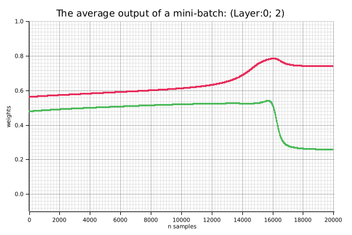
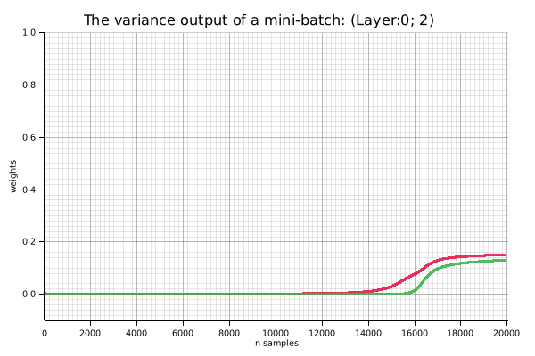
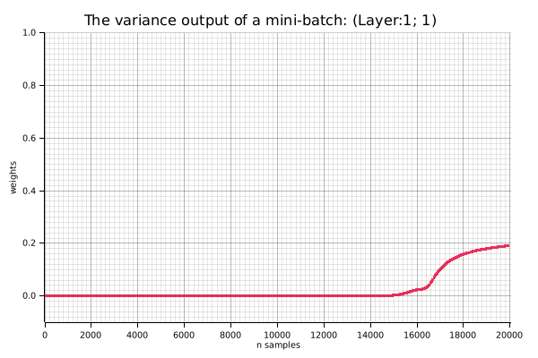
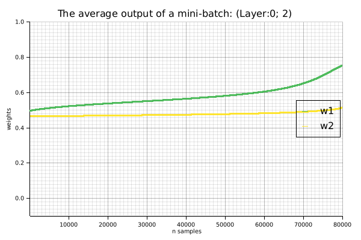
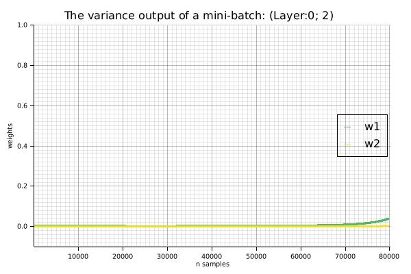
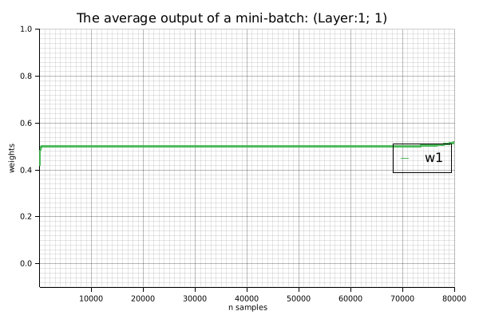
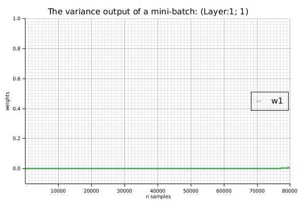

= XOR Regression Example

.References
* https://docs.rs/rand/latest/rand/[rand - Rust^]
* https://docs.rs/rand_distr/latest/rand_distr/[rand_distr - Rust^]
* https://docs.rs/ndarray/latest/ndarray/[ndarray - Rust^]
* https://docs.rs/linfa/latest/linfa/[linfa - Rust^]
* https://docs.rs/linfa-linear/latest/linfa_linear/[linfa_linear - Rust^]
* https://docs.rs/tracing/latest/tracing/index.html[tracing - Rust^]

== Running the Example 1

Learning and inference are performed by extending it to a continuous XOR function.
Note that by adding cross terms to the input, the model is realized as a single-layer neural network.

[source,math]
----
y = w_0 + w_1*x_1 + w_2*x_2 + w_3(x_1*x_2)
----

[source,shell]
.Run the example 1
----
cargo run --bin xor_reg1 --release
----

[source,plaintext]
.Results
----
== XOR Predictions ==
Input: [0.0, 0.0, 0.0] => Predicted: -0.000
Input: [0.0, 1.0, 0.0] => Predicted: 1.000
Input: [1.0, 0.0, 0.0] => Predicted: 1.000
Input: [1.0, 1.0, 1.0] => Predicted: -0.000
----

.Output png image for example 1
image::./images/xor_reg1.gif[]

== Running the Example 2

== Running the Example 3: Scratch

=== Sigmoid: OK 1: 100%

[source,console]
----
$ cargo run --bin xor_reg_scratch --release -- --hidden-activation=sigmoid
    Finished `release` profile [optimized] target(s) in 0.06s
     Running `/home/guest/tmp_github/rust-examples/projects/ml/target/release/xor_reg_scratch --hidden-activation=sigmoid`
learning_rate=0.5, n_samples=20000, mini_batch_size=4, hidden_activation=Sigmoid output_activation=Sigmoid
[00001]: loss=0.2507, delta[0]^T=[[-0.0012, -0.0021]], delta[1]^T=[[0.0260]]
[01000]: loss=0.2500, delta[0]^T=[[0.0000, -0.0001]], delta[1]^T=[[0.0001]]
[02000]: loss=0.2500, delta[0]^T=[[-0.0000, -0.0001]], delta[1]^T=[[0.0001]]
[03000]: loss=0.2500, delta[0]^T=[[-0.0000, -0.0001]], delta[1]^T=[[0.0001]]
[04000]: loss=0.2500, delta[0]^T=[[-0.0000, -0.0001]], delta[1]^T=[[0.0000]]
[05000]: loss=0.2500, delta[0]^T=[[-0.0000, -0.0000]], delta[1]^T=[[0.0000]]
[06000]: loss=0.2500, delta[0]^T=[[-0.0000, -0.0000]], delta[1]^T=[[0.0000]]
[07000]: loss=0.2500, delta[0]^T=[[-0.0001, -0.0000]], delta[1]^T=[[-0.0000]]
[08000]: loss=0.2500, delta[0]^T=[[-0.0001, -0.0000]], delta[1]^T=[[-0.0000]]
[09000]: loss=0.2500, delta[0]^T=[[-0.0001, -0.0000]], delta[1]^T=[[-0.0000]]
[10000]: loss=0.2500, delta[0]^T=[[-0.0002, -0.0000]], delta[1]^T=[[-0.0001]]
[11000]: loss=0.2499, delta[0]^T=[[-0.0002, -0.0000]], delta[1]^T=[[-0.0001]]
[12000]: loss=0.2499, delta[0]^T=[[-0.0004, -0.0000]], delta[1]^T=[[-0.0002]]
[13000]: loss=0.2497, delta[0]^T=[[-0.0008, -0.0000]], delta[1]^T=[[-0.0004]]
[14000]: loss=0.2489, delta[0]^T=[[-0.0020, 0.0000]], delta[1]^T=[[-0.0012]]
[15000]: loss=0.2402, delta[0]^T=[[-0.0060, -0.0002]], delta[1]^T=[[-0.0049]]
[16000]: loss=0.1880, delta[0]^T=[[-0.0085, 0.0051]], delta[1]^T=[[-0.0049]]
[17000]: loss=0.0344, delta[0]^T=[[-0.0009, 0.0079]], delta[1]^T=[[-0.0047]]
[18000]: loss=0.0106, delta[0]^T=[[-0.0005, 0.0022]], delta[1]^T=[[-0.0026]]
[19000]: loss=0.0058, delta[0]^T=[[-0.0004, 0.0011]], delta[1]^T=[[-0.0017]]
[20000]: loss=0.0039, delta[0]^T=[[-0.0003, 0.0007]], delta[1]^T=[[-0.0012]]
== Results ==
learning_rate=0.5, n_samples=20000, mini_batch_size=4, hidden_activation=Sigmoid, output_activation=Sigmoid, elapsed time=0.00[s] 0.0[s/sample]
== Trained ===
layer[0]=[[5.5129, -5.5105],
 [4.3923, -4.6479]]
layer[1]=[[-6.7147, 7.2174]]
Saved the figure to: images/xor_reg_scratch_00_mean.png
Saved the figure to: images/xor_reg_scratch_01_mean.png
Saved the figure to: images/xor_reg_scratch_00_var.png
Saved the figure to: images/xor_reg_scratch_01_var.png

== XOR Predictions ==
Input: [[0.0, 0.0]] => Predicted: 0.06, answer: 0, loss: 0.00
Input: [[0.0, 1.0]] => Predicted: 0.93, answer: 1, loss: 0.00
Input: [[1.0, 0.0]] => Predicted: 0.94, answer: 1, loss: 0.00
Input: [[1.0, 1.0]] => Predicted: 0.06, answer: 0, loss: 0.00
Accuracy: 100.00%
----

image::images/xor_reg_scratch_L02_sigmoid_PASS01.gif[]

image::images/xor_reg_scratch_L02_sigmoid_PASS01_01_mean.png[]

=== Sigmoid: NG 1: 50%

[source,console]
----
$ cargo run --bin xor_reg_scratch --release -- --hidden-activation=sigmoid
learning_rate=0.5, n_samples=20000, mini_batch_size=4, hidden_activation=Sigmoid output_activation=Sigmoid
[00001]: loss=0.2512, delta[0]^T=[[0.0014, -0.0016]], delta[1]^T=[[0.0327]]
[01000]: loss=0.2500, delta[0]^T=[[-0.0000, 0.0000]], delta[1]^T=[[-0.0000]]
[02000]: loss=0.2500, delta[0]^T=[[-0.0000, -0.0000]], delta[1]^T=[[-0.0001]]
[03000]: loss=0.2500, delta[0]^T=[[0.0000, -0.0001]], delta[1]^T=[[-0.0002]]
[04000]: loss=0.2499, delta[0]^T=[[0.0000, -0.0002]], delta[1]^T=[[-0.0003]]
[05000]: loss=0.2498, delta[0]^T=[[0.0000, -0.0004]], delta[1]^T=[[-0.0004]]
[06000]: loss=0.2496, delta[0]^T=[[0.0001, -0.0009]], delta[1]^T=[[-0.0008]]
[07000]: loss=0.2485, delta[0]^T=[[0.0003, -0.0023]], delta[1]^T=[[-0.0021]]
[08000]: loss=0.2368, delta[0]^T=[[0.0009, -0.0063]], delta[1]^T=[[-0.0075]]
[09000]: loss=0.1883, delta[0]^T=[[-0.0029, -0.0072]], delta[1]^T=[[-0.0094]]
[10000]: loss=0.1520, delta[0]^T=[[-0.0033, -0.0025]], delta[1]^T=[[-0.0056]]
[11000]: loss=0.1378, delta[0]^T=[[-0.0011, -0.0010]], delta[1]^T=[[-0.0028]]
[12000]: loss=0.1328, delta[0]^T=[[-0.0006, -0.0006]], delta[1]^T=[[-0.0017]]
[13000]: loss=0.1304, delta[0]^T=[[-0.0004, -0.0004]], delta[1]^T=[[-0.0012]]
[14000]: loss=0.1291, delta[0]^T=[[-0.0003, -0.0003]], delta[1]^T=[[-0.0009]]
[15000]: loss=0.1283, delta[0]^T=[[-0.0002, -0.0002]], delta[1]^T=[[-0.0008]]
[16000]: loss=0.1278, delta[0]^T=[[-0.0002, -0.0002]], delta[1]^T=[[-0.0006]]
[17000]: loss=0.1274, delta[0]^T=[[-0.0001, -0.0001]], delta[1]^T=[[-0.0006]]
[18000]: loss=0.1271, delta[0]^T=[[-0.0001, -0.0001]], delta[1]^T=[[-0.0005]]
[19000]: loss=0.1268, delta[0]^T=[[-0.0001, -0.0001]], delta[1]^T=[[-0.0004]]
[20000]: loss=0.1266, delta[0]^T=[[-0.0001, -0.0001]], delta[1]^T=[[-0.0004]]
== Results ==
learning_rate=0.5, n_samples=20000, mini_batch_size=4, hidden_activation=Sigmoid, output_activation=Sigmoid, elapsed time=0.00[s] 0.0[s/sample]
== Trained ===
layer[0]=[[-3.1772, -7.0418],
 [-4.5524, 7.7691]]
layer[1]=[[-5.2230, -4.6518]]
Saved the figure to: images/xor_reg_scratch_00_mean.png
Saved the figure to: images/xor_reg_scratch_01_mean.png
Saved the figure to: images/xor_reg_scratch_00_var.png
Saved the figure to: images/xor_reg_scratch_01_var.png

== XOR Predictions ==
Input: [[0.0, 0.0]] => Predicted: 0.04, answer: 0, loss: 0.00
Input: [[0.0, 1.0]] => Predicted: 0.50, answer: 1, loss: 0.13
Input: [[1.0, 0.0]] => Predicted: 0.96, answer: 1, loss: 0.00
Input: [[1.0, 1.0]] => Predicted: 0.50, answer: 0, loss: 0.13
Accuracy: 50.00%
----

image::images/xor_reg_scratch_L02_sigmoid_FAIL01.gif[]

image::images/xor_reg_scratch_L02_sigmoid_FAIL01_00_mean.png[]

image::images/xor_reg_scratch_L02_sigmoid_FAIL01_00_var.png[]

image::images/xor_reg_scratch_L02_sigmoid_FAIL01_01_mean.png[]

image::images/xor_reg_scratch_L02_sigmoid_FAIL01_01_var.png[]

=== Sigmoid: 2 layers : NG 2: Accuracy 0%

The neural network is initialized with random values in the range (-0.5, 0.5). Unfortunately, the cosine similarity in this case is -0.97, which is close to 1 in absolute value. This is because the weight matrices are not orthogonal and the gradient vectors point in the same direction. As a result, the gradients are corrected in almost the same direction and do not converge.

[source,shell]
----
cargo run --bin xor_reg_scratch --release
----

[source,json]
----
{"timestamp":"2026-01-18T11:41:27.973407Z","level":"INFO","fields":{"event":"Verifying orthogonality of weight matrices for training","layer_no":0,"cosine_similarity":-0.9785690003734441},"target":"xor_reg_scratch"}
{"timestamp":"2026-01-18T11:41:27.973457Z","level":"INFO","fields":{"event":"Show layer information","layers":2,"learning_rate":0.5,"max_iteration":20000,"mini_batch_size":4,"hidden_activation":"Sigmoid","output_activation":"Sigmoid"},"target":"xor_reg_scratch"}
{"timestamp":"2026-01-18T11:41:27.973511Z","level":"INFO","fields":{"iteration":4,"total_trials":0,"loss":0.25657393082917207,"weight":", h[0].weight=[[-0.433, -0.159], [0.191, 0.120]], bias[0]=[[0.269], [-0.292]], delta[0]=[[-0.0033], [0.0010]], h[1].weight=[[0.168, -0.048]], bias[1]=[[-0.373]], delta[1]=[[-0.0789]]"},"target":"xor_reg_scratch"}
{"timestamp":"2026-01-18T11:41:27.977421Z","level":"INFO","fields":{"iteration":4000,"total_trials":999,"loss":0.2500057345137394,"weight":", h[0].weight=[[-0.401, -0.137], [0.193, 0.119]], bias[0]=[[0.311], [-0.290]], delta[0]=[[-0.0002], [-0.0000]], h[1].weight=[[0.255, 0.058]], bias[1]=[[-0.157]], delta[1]=[[-0.0000]]"},"target":"xor_reg_scratch"}
{"timestamp":"2026-01-18T11:41:27.982224Z","level":"INFO","fields":{"iteration":8000,"total_trials":1999,"loss":0.25000093726738026,"weight":", h[0].weight=[[-0.382, -0.133], [0.195, 0.118]], bias[0]=[[0.336], [-0.287]], delta[0]=[[-0.0002], [-0.0000]], h[1].weight=[[0.244, 0.062]], bias[1]=[[-0.156]], delta[1]=[[-0.0000]]"},"target":"xor_reg_scratch"}
{"timestamp":"2026-01-18T11:41:27.988735Z","level":"INFO","fields":{"iteration":12000,"total_trials":2999,"loss":0.24999762534506625,"weight":", h[0].weight=[[-0.367, -0.135], [0.197, 0.117]], bias[0]=[[0.359], [-0.284]], delta[0]=[[-0.0002], [-0.0000]], h[1].weight=[[0.237, 0.065]], bias[1]=[[-0.155]], delta[1]=[[0.0000]]"},"target":"xor_reg_scratch"}
{"timestamp":"2026-01-18T11:41:27.993354Z","level":"INFO","fields":{"iteration":16000,"total_trials":3999,"loss":0.24999479887317122,"weight":", h[0].weight=[[-0.356, -0.141], [0.199, 0.116]], bias[0]=[[0.381], [-0.281]], delta[0]=[[-0.0002], [-0.0000]], h[1].weight=[[0.234, 0.067]], bias[1]=[[-0.156]], delta[1]=[[0.0000]]"},"target":"xor_reg_scratch"}
{"timestamp":"2026-01-18T11:41:27.999000Z","level":"INFO","fields":{"iteration":20000,"total_trials":4999,"loss":0.24999201494539147,"weight":", h[0].weight=[[-0.346, -0.149], [0.201, 0.115]], bias[0]=[[0.404], [-0.278]], delta[0]=[[-0.0002], [-0.0000]], h[1].weight=[[0.234, 0.069]], bias[1]=[[-0.158]], delta[1]=[[0.0000]]"},"target":"xor_reg_scratch"}
{"timestamp":"2026-01-18T11:41:28.004971Z","level":"INFO","fields":{"iteration":24000,"total_trials":5999,"loss":0.24998900233143637,"weight":", h[0].weight=[[-0.338, -0.160], [0.203, 0.115]], bias[0]=[[0.427], [-0.275]], delta[0]=[[-0.0002], [-0.0000]], h[1].weight=[[0.236, 0.070]], bias[1]=[[-0.161]], delta[1]=[[0.0000]]"},"target":"xor_reg_scratch"}
{"timestamp":"2026-01-18T11:41:28.009377Z","level":"INFO","fields":{"iteration":28000,"total_trials":6999,"loss":0.24998552617546788,"weight":", h[0].weight=[[-0.333, -0.173], [0.205, 0.114]], bias[0]=[[0.452], [-0.272]], delta[0]=[[-0.0002], [-0.0000]], h[1].weight=[[0.241, 0.071]], bias[1]=[[-0.166]], delta[1]=[[0.0000]]"},"target":"xor_reg_scratch"}
{"timestamp":"2026-01-18T11:41:28.015970Z","level":"INFO","fields":{"iteration":32000,"total_trials":7999,"loss":0.24998131831229942,"weight":", h[0].weight=[[-0.329, -0.187], [0.207, 0.114]], bias[0]=[[0.479], [-0.269]], delta[0]=[[-0.0002], [-0.0000]], h[1].weight=[[0.248, 0.072]], bias[1]=[[-0.171]], delta[1]=[[0.0001]]"},"target":"xor_reg_scratch"}
{"timestamp":"2026-01-18T11:41:28.020692Z","level":"INFO","fields":{"iteration":36000,"total_trials":8999,"loss":0.24997601540057635,"weight":", h[0].weight=[[-0.327, -0.204], [0.209, 0.114]], bias[0]=[[0.509], [-0.266]], delta[0]=[[-0.0003], [-0.0000]], h[1].weight=[[0.258, 0.072]], bias[1]=[[-0.179]], delta[1]=[[0.0001]]"},"target":"xor_reg_scratch"}
{"timestamp":"2026-01-18T11:41:28.025318Z","level":"INFO","fields":{"iteration":40000,"total_trials":9999,"loss":0.24996907263883167,"weight":", h[0].weight=[[-0.329, -0.223], [0.212, 0.114]], bias[0]=[[0.542], [-0.263]], delta[0]=[[-0.0003], [-0.0000]], h[1].weight=[[0.271, 0.073]], bias[1]=[[-0.188]], delta[1]=[[0.0001]]"},"target":"xor_reg_scratch"}
{"timestamp":"2026-01-18T11:41:28.030107Z","level":"INFO","fields":{"iteration":44000,"total_trials":10999,"loss":0.24995961311000678,"weight":", h[0].weight=[[-0.333, -0.244], [0.215, 0.115]], bias[0]=[[0.580], [-0.259]], delta[0]=[[-0.0003], [-0.0000]], h[1].weight=[[0.287, 0.074]], bias[1]=[[-0.199]], delta[1]=[[0.0001]]"},"target":"xor_reg_scratch"}
{"timestamp":"2026-01-18T11:41:28.034470Z","level":"INFO","fields":{"iteration":48000,"total_trials":11999,"loss":0.24994613364483154,"weight":", h[0].weight=[[-0.342, -0.269], [0.218, 0.116]], bias[0]=[[0.625], [-0.256]], delta[0]=[[-0.0004], [-0.0000]], h[1].weight=[[0.308, 0.075]], bias[1]=[[-0.213]], delta[1]=[[0.0001]]"},"target":"xor_reg_scratch"}
{"timestamp":"2026-01-18T11:41:28.038773Z","level":"INFO","fields":{"iteration":52000,"total_trials":12999,"loss":0.2499258792071784,"weight":", h[0].weight=[[-0.357, -0.299], [0.221, 0.117]], bias[0]=[[0.680], [-0.253]], delta[0]=[[-0.0005], [-0.0000]], h[1].weight=[[0.333, 0.076]], bias[1]=[[-0.231]], delta[1]=[[0.0002]]"},"target":"xor_reg_scratch"}
{"timestamp":"2026-01-18T11:41:28.043433Z","level":"INFO","fields":{"iteration":56000,"total_trials":13999,"loss":0.24989338415427592,"weight":", h[0].weight=[[-0.379, -0.335], [0.226, 0.120]], bias[0]=[[0.747], [-0.249]], delta[0]=[[-0.0006], [-0.0000]], h[1].weight=[[0.366, 0.078]], bias[1]=[[-0.254]], delta[1]=[[0.0002]]"},"target":"xor_reg_scratch"}
{"timestamp":"2026-01-18T11:41:28.048041Z","level":"INFO","fields":{"iteration":60000,"total_trials":14999,"loss":0.24983666882346783,"weight":", h[0].weight=[[-0.414, -0.382], [0.231, 0.124]], bias[0]=[[0.836], [-0.245]], delta[0]=[[-0.0008], [-0.0000]], h[1].weight=[[0.409, 0.080]], bias[1]=[[-0.285]], delta[1]=[[0.0003]]"},"target":"xor_reg_scratch"}
{"timestamp":"2026-01-18T11:41:28.052523Z","level":"INFO","fields":{"iteration":64000,"total_trials":15999,"loss":0.24972580615619477,"weight":", h[0].weight=[[-0.467, -0.445], [0.238, 0.130]], bias[0]=[[0.958], [-0.242]], delta[0]=[[-0.0012], [-0.0000]], h[1].weight=[[0.470, 0.083]], bias[1]=[[-0.330]], delta[1]=[[0.0004]]"},"target":"xor_reg_scratch"}
{"timestamp":"2026-01-18T11:41:28.057199Z","level":"INFO","fields":{"iteration":68000,"total_trials":16999,"loss":0.24947152053216884,"weight":", h[0].weight=[[-0.553, -0.540], [0.248, 0.139]], bias[0]=[[1.139], [-0.238]], delta[0]=[[-0.0018], [-0.0000]], h[1].weight=[[0.561, 0.087]], bias[1]=[[-0.398]], delta[1]=[[0.0007]]"},"target":"xor_reg_scratch"}
{"timestamp":"2026-01-18T11:41:28.062061Z","level":"INFO","fields":{"iteration":72000,"total_trials":17999,"loss":0.2487340101413424,"weight":", h[0].weight=[[-0.708, -0.701], [0.263, 0.153]], bias[0]=[[1.441], [-0.234]], delta[0]=[[-0.0032], [-0.0000]], h[1].weight=[[0.717, 0.090]], bias[1]=[[-0.515]], delta[1]=[[0.0013]]"},"target":"xor_reg_scratch"}
{"timestamp":"2026-01-18T11:41:28.066919Z","level":"INFO","fields":{"iteration":76000,"total_trials":18999,"loss":0.2457721395085065,"weight":", h[0].weight=[[-1.032, -1.028], [0.288, 0.179]], bias[0]=[[2.021], [-0.231]], delta[0]=[[-0.0066], [-0.0000]], h[1].weight=[[1.032, 0.090]], bias[1]=[[-0.755]], delta[1]=[[0.0028]]"},"target":"xor_reg_scratch"}
{"timestamp":"2026-01-18T11:41:28.071652Z","level":"INFO","fields":{"iteration":80000,"total_trials":19999,"loss":0.2317689353082802,"weight":", h[0].weight=[[-1.763, -1.761], [0.344, 0.236]], bias[0]=[[3.232], [-0.234]], delta[0]=[[-0.0130], [0.0001]], h[1].weight=[[1.743, 0.117]], bias[1]=[[-1.309]], delta[1]=[[0.0063]]"},"target":"xor_reg_scratch"}
{"timestamp":"2026-01-18T11:41:28.071669Z","level":"INFO","fields":{"event":"Results","layers":2,"iteration":80000,"mini_batch_size":4,"total_trials":19999,"learning_rate":0.5,"hidden_activation":"Sigmoid","output_activation":"Sigmoid","elapsed_time":0,"sec_per_mini_batch":0.0},"target":"xor_reg_scratch"}
{"timestamp":"2026-01-18T11:41:28.071680Z","level":"INFO","fields":{"event":"Weights and biases after the training process","layer_no":0,"weight":"[[-1.7632, -1.7608], [0.3441, 0.2358]], shape=[2, 2], strides=[2, 1], layout=Cc (0x5), const ndim=2","bias":"[[3.2324], [-0.2338]], shape=[2, 1], strides=[1, 1], layout=CFcf (0xf), const ndim=2"},"target":"xor_reg_scratch"}
{"timestamp":"2026-01-18T11:41:28.071685Z","level":"INFO","fields":{"event":"Weights and biases after the training process","layer_no":1,"weight":"[[1.7433, 0.1172]], shape=[1, 2], strides=[2, 1], layout=CFcf (0xf), const ndim=2","bias":"[[-1.3086]], shape=[1, 1], strides=[1, 1], layout=CFcf (0xf), const ndim=2"},"target":"xor_reg_scratch"}
{"timestamp":"2026-01-18T11:41:28.087263Z","level":"INFO","fields":{"message":"Saved the figure to: images/xor_reg_scratch_L02_sigmoid_00_mean.png"},"target":"xor_reg_scratch"}
{"timestamp":"2026-01-18T11:41:28.090973Z","level":"INFO","fields":{"message":"Saved the figure to: images/xor_reg_scratch_L02_sigmoid_01_mean.png"},"target":"xor_reg_scratch"}
{"timestamp":"2026-01-18T11:41:28.094673Z","level":"INFO","fields":{"message":"Saved the figure to: images/xor_reg_scratch_L02_sigmoid_00_var.png"},"target":"xor_reg_scratch"}
{"timestamp":"2026-01-18T11:41:28.097511Z","level":"INFO","fields":{"message":"Saved the figure to: images/xor_reg_scratch_L02_sigmoid_01_var.png"},"target":"xor_reg_scratch"}
{"timestamp":"2026-01-18T11:41:28.098735Z","level":"INFO","fields":{"event":"XOR predictions","inputs":"[0, 0]","predicted":"0.60","answer":"1","loss":"0.00"},"target":"xor_reg_scratch"}
{"timestamp":"2026-01-18T11:41:28.098768Z","level":"INFO","fields":{"event":"XOR predictions","inputs":"[0, 1]","predicted":"0.54","answer":"1","loss":"1.00"},"target":"xor_reg_scratch"}
{"timestamp":"2026-01-18T11:41:28.098773Z","level":"INFO","fields":{"event":"XOR predictions","inputs":"[1, 0]","predicted":"0.54","answer":"1","loss":"1.00"},"target":"xor_reg_scratch"}
{"timestamp":"2026-01-18T11:41:28.098777Z","level":"INFO","fields":{"event":"XOR predictions","inputs":"[1, 1]","predicted":"0.38","answer":"0","loss":"0.00"},"target":"xor_reg_scratch"}
{"timestamp":"2026-01-18T11:41:28.098783Z","level":"INFO","fields":{"accuracy":0.0,"layers":2,"learning_rate":0.5,"iteration":80000,"total_trials":19999,"mini_batch_size":4,"hidden_activation":"Sigmoid","output_activation":"Sigmoid","cosine_similarities":"[\"-0.9785690003734441\"]"},"target":"xor_reg_scratch"}
----

image::images/xor_reg_scratch_L02_sigmoid_ng2.gif[]

=== ReLu: Success

[source,console]
----
$ cargo run --bin xor_reg_scratch --release -- --hidden-activation=relu
...snip...
learning_rate=0.5, n_samples=20000, mini_batch_size=4, hidden_activation=ReLU output_activation=Sigmoid
[00001]: loss=0.3975, delta[0]^T=[[-0.3872, -0.1282]], delta[1]^T=[[-1.4723]]
[01000]: loss=0.0000, delta[0]^T=[[0.0000, -0.0000]], delta[1]^T=[[0.0000]]
[02000]: loss=0.0000, delta[0]^T=[[0.0000, -0.0000]], delta[1]^T=[[-0.0000]]
[03000]: loss=0.0000, delta[0]^T=[[0.0000, -0.0000]], delta[1]^T=[[-0.0000]]
[04000]: loss=0.0000, delta[0]^T=[[0.0000, -0.0000]], delta[1]^T=[[0.0000]]
[05000]: loss=0.0000, delta[0]^T=[[0.0000, -0.0000]], delta[1]^T=[[-0.0000]]
[06000]: loss=0.0000, delta[0]^T=[[0.0000, -0.0000]], delta[1]^T=[[-0.0000]]
[07000]: loss=0.0000, delta[0]^T=[[0.0000, -0.0000]], delta[1]^T=[[-0.0000]]
[08000]: loss=0.0000, delta[0]^T=[[0.0000, -0.0000]], delta[1]^T=[[0.0000]]
[09000]: loss=0.0000, delta[0]^T=[[0.0000, -0.0000]], delta[1]^T=[[-0.0000]]
[10000]: loss=0.0000, delta[0]^T=[[0.0000, -0.0000]], delta[1]^T=[[-0.0000]]
[11000]: loss=0.0000, delta[0]^T=[[0.0000, -0.0000]], delta[1]^T=[[0.0000]]
[12000]: loss=0.0000, delta[0]^T=[[0.0000, -0.0000]], delta[1]^T=[[-0.0000]]
[13000]: loss=0.0000, delta[0]^T=[[0.0000, -0.0000]], delta[1]^T=[[-0.0000]]
[14000]: loss=0.0000, delta[0]^T=[[0.0000, -0.0000]], delta[1]^T=[[-0.0000]]
[15000]: loss=0.0000, delta[0]^T=[[0.0000, -0.0000]], delta[1]^T=[[0.0000]]
[16000]: loss=0.0000, delta[0]^T=[[0.0000, -0.0000]], delta[1]^T=[[-0.0000]]
[17000]: loss=0.0000, delta[0]^T=[[0.0000, -0.0000]], delta[1]^T=[[-0.0000]]
[18000]: loss=0.0000, delta[0]^T=[[0.0000, -0.0000]], delta[1]^T=[[0.0000]]
[19000]: loss=0.0000, delta[0]^T=[[0.0000, -0.0000]], delta[1]^T=[[-0.0000]]
[20000]: loss=0.0000, delta[0]^T=[[0.0000, -0.0000]], delta[1]^T=[[-0.0000]]
== Results ==
learning_rate=0.5, n_samples=20000, mini_batch_size=4, hidden_activation=ReLU, output_activation=Sigmoid, elapsed time=0.00[s] 0.0[s/sample]
== Trained ===
layer[0]=[[0.8880, -0.8880],
 [-0.8764, 0.8764]]
layer[1]=[[1.1375, 1.1526]]
Saved the figure to: images/xor_reg_scratch_00_mean.png
Saved the figure to: images/xor_reg_scratch_01_mean.png
Saved the figure to: images/xor_reg_scratch_00_var.png
Saved the figure to: images/xor_reg_scratch_01_var.png

== XOR Predictions ==
Input: [[0.0, 0.0]] => Predicted: 0.00, answer: 0, loss: 0.00
Input: [[0.0, 1.0]] => Predicted: 1.00, answer: 1, loss: 0.00
Input: [[1.0, 0.0]] => Predicted: 1.00, answer: 1, loss: 0.00
Input: [[1.0, 1.0]] => Predicted: 0.00, answer: 0, loss: 0.00
Accuracy: 100.00%
----

image::images/xor_reg_scratch_L02_relu_PASS01.gif[]

image::images/xor_reg_scratch_L02_relu_PASS01_00_mean.png[]

image::images/xor_reg_scratch_L02_relu_PASS01_00_var.png[]

image::images/xor_reg_scratch_L02_relu_PASS01_01_mean.png[]

image::images/xor_reg_scratch_L02_relu_PASS01_01_var.png[]
