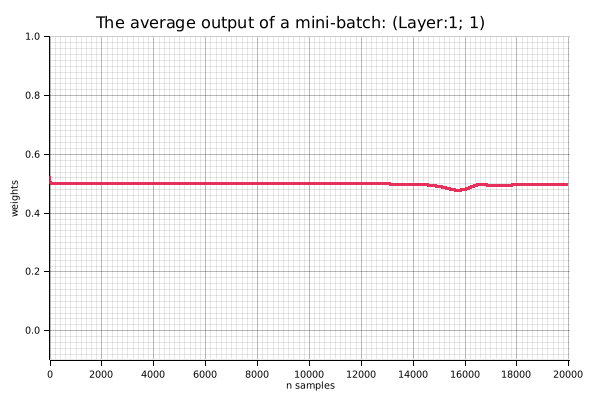
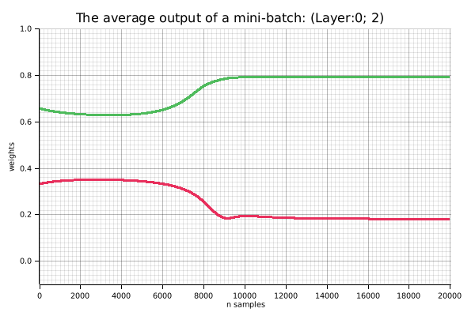
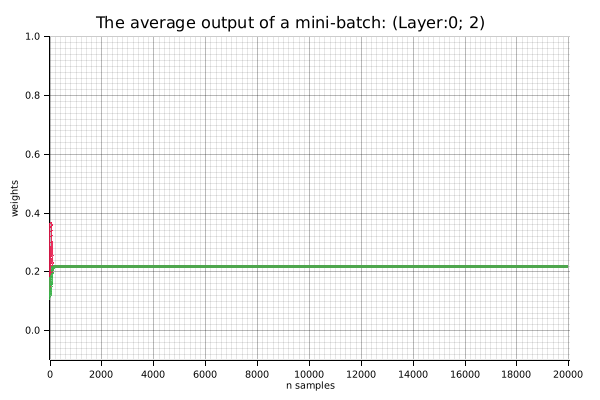
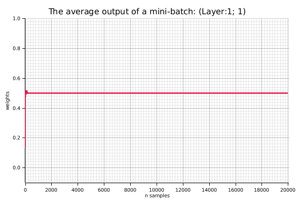

= XOR Regression Example

.References
* https://docs.rs/rand/latest/rand/[rand - Rust^]
* https://docs.rs/rand_distr/latest/rand_distr/[rand_distr - Rust^]
* https://docs.rs/ndarray/latest/ndarray/[ndarray - Rust^]
* https://docs.rs/linfa/latest/linfa/[linfa - Rust^]
* https://docs.rs/linfa-linear/latest/linfa_linear/[linfa_linear - Rust^]
* https://docs.rs/tracing/latest/tracing/index.html[tracing - Rust^]

== Running the Example 1

Learning and inference are performed by extending it to a continuous XOR function.
Note that by adding cross terms to the input, the model is realized as a single-layer neural network.

[source,math]
----
y = w_0 + w_1*x_1 + w_2*x_2 + w_3(x_1*x_2)
----

[source,shell]
.Run the example 1
----
cargo run --bin xor_reg1 --release
----

[source,plaintext]
.Results
----
== XOR Predictions ==
Input: [0.0, 0.0, 0.0] => Predicted: -0.000
Input: [0.0, 1.0, 0.0] => Predicted: 1.000
Input: [1.0, 0.0, 0.0] => Predicted: 1.000
Input: [1.0, 1.0, 1.0] => Predicted: -0.000
----

.Output png image for example 1
image::./images/xor_reg1.gif[]

== Running the Example 2

== Running the Example 3: Scratch

=== Sigmoid: OK 1: 100%

[source,console]
----
$ cargo run --bin xor_reg_scratch --release -- --hidden-activation=sigmoid
    Finished `release` profile [optimized] target(s) in 0.06s
     Running `/home/guest/tmp_github/rust-examples/projects/ml/target/release/xor_reg_scratch --hidden-activation=sigmoid`
learning_rate=0.5, n_samples=20000, mini_batch_size=4, hidden_activation=Sigmoid output_activation=Sigmoid
[00001]: loss=0.2507, delta[0]^T=[[-0.0012, -0.0021]], delta[1]^T=[[0.0260]]
[01000]: loss=0.2500, delta[0]^T=[[0.0000, -0.0001]], delta[1]^T=[[0.0001]]
[02000]: loss=0.2500, delta[0]^T=[[-0.0000, -0.0001]], delta[1]^T=[[0.0001]]
[03000]: loss=0.2500, delta[0]^T=[[-0.0000, -0.0001]], delta[1]^T=[[0.0001]]
[04000]: loss=0.2500, delta[0]^T=[[-0.0000, -0.0001]], delta[1]^T=[[0.0000]]
[05000]: loss=0.2500, delta[0]^T=[[-0.0000, -0.0000]], delta[1]^T=[[0.0000]]
[06000]: loss=0.2500, delta[0]^T=[[-0.0000, -0.0000]], delta[1]^T=[[0.0000]]
[07000]: loss=0.2500, delta[0]^T=[[-0.0001, -0.0000]], delta[1]^T=[[-0.0000]]
[08000]: loss=0.2500, delta[0]^T=[[-0.0001, -0.0000]], delta[1]^T=[[-0.0000]]
[09000]: loss=0.2500, delta[0]^T=[[-0.0001, -0.0000]], delta[1]^T=[[-0.0000]]
[10000]: loss=0.2500, delta[0]^T=[[-0.0002, -0.0000]], delta[1]^T=[[-0.0001]]
[11000]: loss=0.2499, delta[0]^T=[[-0.0002, -0.0000]], delta[1]^T=[[-0.0001]]
[12000]: loss=0.2499, delta[0]^T=[[-0.0004, -0.0000]], delta[1]^T=[[-0.0002]]
[13000]: loss=0.2497, delta[0]^T=[[-0.0008, -0.0000]], delta[1]^T=[[-0.0004]]
[14000]: loss=0.2489, delta[0]^T=[[-0.0020, 0.0000]], delta[1]^T=[[-0.0012]]
[15000]: loss=0.2402, delta[0]^T=[[-0.0060, -0.0002]], delta[1]^T=[[-0.0049]]
[16000]: loss=0.1880, delta[0]^T=[[-0.0085, 0.0051]], delta[1]^T=[[-0.0049]]
[17000]: loss=0.0344, delta[0]^T=[[-0.0009, 0.0079]], delta[1]^T=[[-0.0047]]
[18000]: loss=0.0106, delta[0]^T=[[-0.0005, 0.0022]], delta[1]^T=[[-0.0026]]
[19000]: loss=0.0058, delta[0]^T=[[-0.0004, 0.0011]], delta[1]^T=[[-0.0017]]
[20000]: loss=0.0039, delta[0]^T=[[-0.0003, 0.0007]], delta[1]^T=[[-0.0012]]
== Results ==
learning_rate=0.5, n_samples=20000, mini_batch_size=4, hidden_activation=Sigmoid, output_activation=Sigmoid, elapsed time=0.00[s] 0.0[s/sample]
== Trained ===
layer[0]=[[5.5129, -5.5105],
 [4.3923, -4.6479]]
layer[1]=[[-6.7147, 7.2174]]
Saved the figure to: images/xor_reg_scratch_00_mean.png
Saved the figure to: images/xor_reg_scratch_01_mean.png
Saved the figure to: images/xor_reg_scratch_00_var.png
Saved the figure to: images/xor_reg_scratch_01_var.png

== XOR Predictions ==
Input: [[0.0, 0.0]] => Predicted: 0.06, answer: 0, loss: 0.00
Input: [[0.0, 1.0]] => Predicted: 0.93, answer: 1, loss: 0.00
Input: [[1.0, 0.0]] => Predicted: 0.94, answer: 1, loss: 0.00
Input: [[1.0, 1.0]] => Predicted: 0.06, answer: 0, loss: 0.00
Accuracy: 100.00%
----

image::images/xor_reg_scratch_sigmoid_ok1.gif[]

image::images/xor_reg_scratch_sigmoid_ok1_00_mean.png[]

image::images/xor_reg_scratch_sigmoid_ng1_00_var.png[]

image::images/xor_reg_scratch_sigmoid_ng1_01_var.png[]

=== Sigmoid: NG 1: 50%

[source,console]
----
$ cargo run --bin xor_reg_scratch --release -- --hidden-activation=sigmoid
learning_rate=0.5, n_samples=20000, mini_batch_size=4, hidden_activation=Sigmoid output_activation=Sigmoid
[00001]: loss=0.2512, delta[0]^T=[[0.0014, -0.0016]], delta[1]^T=[[0.0327]]
[01000]: loss=0.2500, delta[0]^T=[[-0.0000, 0.0000]], delta[1]^T=[[-0.0000]]
[02000]: loss=0.2500, delta[0]^T=[[-0.0000, -0.0000]], delta[1]^T=[[-0.0001]]
[03000]: loss=0.2500, delta[0]^T=[[0.0000, -0.0001]], delta[1]^T=[[-0.0002]]
[04000]: loss=0.2499, delta[0]^T=[[0.0000, -0.0002]], delta[1]^T=[[-0.0003]]
[05000]: loss=0.2498, delta[0]^T=[[0.0000, -0.0004]], delta[1]^T=[[-0.0004]]
[06000]: loss=0.2496, delta[0]^T=[[0.0001, -0.0009]], delta[1]^T=[[-0.0008]]
[07000]: loss=0.2485, delta[0]^T=[[0.0003, -0.0023]], delta[1]^T=[[-0.0021]]
[08000]: loss=0.2368, delta[0]^T=[[0.0009, -0.0063]], delta[1]^T=[[-0.0075]]
[09000]: loss=0.1883, delta[0]^T=[[-0.0029, -0.0072]], delta[1]^T=[[-0.0094]]
[10000]: loss=0.1520, delta[0]^T=[[-0.0033, -0.0025]], delta[1]^T=[[-0.0056]]
[11000]: loss=0.1378, delta[0]^T=[[-0.0011, -0.0010]], delta[1]^T=[[-0.0028]]
[12000]: loss=0.1328, delta[0]^T=[[-0.0006, -0.0006]], delta[1]^T=[[-0.0017]]
[13000]: loss=0.1304, delta[0]^T=[[-0.0004, -0.0004]], delta[1]^T=[[-0.0012]]
[14000]: loss=0.1291, delta[0]^T=[[-0.0003, -0.0003]], delta[1]^T=[[-0.0009]]
[15000]: loss=0.1283, delta[0]^T=[[-0.0002, -0.0002]], delta[1]^T=[[-0.0008]]
[16000]: loss=0.1278, delta[0]^T=[[-0.0002, -0.0002]], delta[1]^T=[[-0.0006]]
[17000]: loss=0.1274, delta[0]^T=[[-0.0001, -0.0001]], delta[1]^T=[[-0.0006]]
[18000]: loss=0.1271, delta[0]^T=[[-0.0001, -0.0001]], delta[1]^T=[[-0.0005]]
[19000]: loss=0.1268, delta[0]^T=[[-0.0001, -0.0001]], delta[1]^T=[[-0.0004]]
[20000]: loss=0.1266, delta[0]^T=[[-0.0001, -0.0001]], delta[1]^T=[[-0.0004]]
== Results ==
learning_rate=0.5, n_samples=20000, mini_batch_size=4, hidden_activation=Sigmoid, output_activation=Sigmoid, elapsed time=0.00[s] 0.0[s/sample]
== Trained ===
layer[0]=[[-3.1772, -7.0418],
 [-4.5524, 7.7691]]
layer[1]=[[-5.2230, -4.6518]]
Saved the figure to: images/xor_reg_scratch_00_mean.png
Saved the figure to: images/xor_reg_scratch_01_mean.png
Saved the figure to: images/xor_reg_scratch_00_var.png
Saved the figure to: images/xor_reg_scratch_01_var.png

== XOR Predictions ==
Input: [[0.0, 0.0]] => Predicted: 0.04, answer: 0, loss: 0.00
Input: [[0.0, 1.0]] => Predicted: 0.50, answer: 1, loss: 0.13
Input: [[1.0, 0.0]] => Predicted: 0.96, answer: 1, loss: 0.00
Input: [[1.0, 1.0]] => Predicted: 0.50, answer: 0, loss: 0.13
Accuracy: 50.00%
----

image::images/xor_reg_scratch_sigmoid_ng1.gif[]

image::images/xor_reg_scratch_sigmoid_ng1_00_var.png[]

image::images/xor_reg_scratch_sigmoid_ng1_01_mean.png[]

image::images/xor_reg_scratch_sigmoid_ng1_01_var.png[]

=== ReLu: Success

[source,console]
----
$ cargo run --bin xor_reg_scratch --release -- --hidden-activation=relu
...snip...
learning_rate=0.5, n_samples=20000, mini_batch_size=4, hidden_activation=ReLU output_activation=Sigmoid
[00001]: loss=0.3975, delta[0]^T=[[-0.3872, -0.1282]], delta[1]^T=[[-1.4723]]
[01000]: loss=0.0000, delta[0]^T=[[0.0000, -0.0000]], delta[1]^T=[[0.0000]]
[02000]: loss=0.0000, delta[0]^T=[[0.0000, -0.0000]], delta[1]^T=[[-0.0000]]
[03000]: loss=0.0000, delta[0]^T=[[0.0000, -0.0000]], delta[1]^T=[[-0.0000]]
[04000]: loss=0.0000, delta[0]^T=[[0.0000, -0.0000]], delta[1]^T=[[0.0000]]
[05000]: loss=0.0000, delta[0]^T=[[0.0000, -0.0000]], delta[1]^T=[[-0.0000]]
[06000]: loss=0.0000, delta[0]^T=[[0.0000, -0.0000]], delta[1]^T=[[-0.0000]]
[07000]: loss=0.0000, delta[0]^T=[[0.0000, -0.0000]], delta[1]^T=[[-0.0000]]
[08000]: loss=0.0000, delta[0]^T=[[0.0000, -0.0000]], delta[1]^T=[[0.0000]]
[09000]: loss=0.0000, delta[0]^T=[[0.0000, -0.0000]], delta[1]^T=[[-0.0000]]
[10000]: loss=0.0000, delta[0]^T=[[0.0000, -0.0000]], delta[1]^T=[[-0.0000]]
[11000]: loss=0.0000, delta[0]^T=[[0.0000, -0.0000]], delta[1]^T=[[0.0000]]
[12000]: loss=0.0000, delta[0]^T=[[0.0000, -0.0000]], delta[1]^T=[[-0.0000]]
[13000]: loss=0.0000, delta[0]^T=[[0.0000, -0.0000]], delta[1]^T=[[-0.0000]]
[14000]: loss=0.0000, delta[0]^T=[[0.0000, -0.0000]], delta[1]^T=[[-0.0000]]
[15000]: loss=0.0000, delta[0]^T=[[0.0000, -0.0000]], delta[1]^T=[[0.0000]]
[16000]: loss=0.0000, delta[0]^T=[[0.0000, -0.0000]], delta[1]^T=[[-0.0000]]
[17000]: loss=0.0000, delta[0]^T=[[0.0000, -0.0000]], delta[1]^T=[[-0.0000]]
[18000]: loss=0.0000, delta[0]^T=[[0.0000, -0.0000]], delta[1]^T=[[0.0000]]
[19000]: loss=0.0000, delta[0]^T=[[0.0000, -0.0000]], delta[1]^T=[[-0.0000]]
[20000]: loss=0.0000, delta[0]^T=[[0.0000, -0.0000]], delta[1]^T=[[-0.0000]]
== Results ==
learning_rate=0.5, n_samples=20000, mini_batch_size=4, hidden_activation=ReLU, output_activation=Sigmoid, elapsed time=0.00[s] 0.0[s/sample]
== Trained ===
layer[0]=[[0.8880, -0.8880],
 [-0.8764, 0.8764]]
layer[1]=[[1.1375, 1.1526]]
Saved the figure to: images/xor_reg_scratch_00_mean.png
Saved the figure to: images/xor_reg_scratch_01_mean.png
Saved the figure to: images/xor_reg_scratch_00_var.png
Saved the figure to: images/xor_reg_scratch_01_var.png

== XOR Predictions ==
Input: [[0.0, 0.0]] => Predicted: 0.00, answer: 0, loss: 0.00
Input: [[0.0, 1.0]] => Predicted: 1.00, answer: 1, loss: 0.00
Input: [[1.0, 0.0]] => Predicted: 1.00, answer: 1, loss: 0.00
Input: [[1.0, 1.0]] => Predicted: 0.00, answer: 0, loss: 0.00
Accuracy: 100.00%
----

image::images/xor_reg_scratch_relu_ok1.gif[]

image::images/xor_reg_scratch_relu_ok1_00_var.png[]

image::images/xor_reg_scratch_relu_ok1_01_var.png[]
