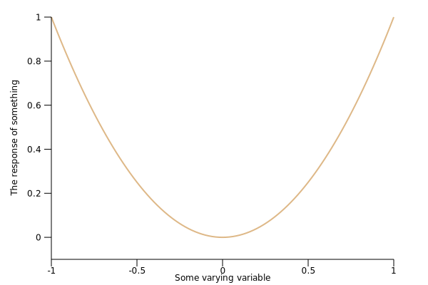

=== create a new binary project

. Let's create a new binary project called `plotlib-x-squared`
+
[source,console]
----
$ cargo new plotlib-x-squared --bin
     Created binary (application) `plotlib-x-squared` package
----
+
[source,console]
----
$ cd plotlib-x-squared/
----

=== Code

[source,rust]
.src/main.rs
----
use plotlib::page::Page;
use plotlib::repr::Plot;
use plotlib::view::ContinuousView;
use plotlib::style::LineStyle;

fn main() {
    // Scatter plots expect a list of pairs
    let data1: Vec<(f64,f64)> = (-50..=50).map(
        |x| x as f64 / 50.0
    ).map(|x| (x, x * x)).collect();

    // We create our scatter plot from the data
    let l1 = Plot::new(data1).line_style(
        LineStyle::new().colour("burlywood")
    );

    // The 'view' describes what set of data is drawn
    let v = ContinuousView::new()
        .add(l1)
        .x_range(-1., 1.)
        .y_range(-0.1, 1.)
        .x_label("Some varying variable")
        .y_label("The response of something");

    // A page with a single view is then saved to an SVG file
    Page::single(&v).save("images/0.svg").unwrap();
}
----

=== Run

[source,console]
----
$ cargo run
    Finished dev [unoptimized + debuginfo] target(s) in 0.11s
     Running `target/debug/plotlib-x-squared`
----

.Results

=== References

* https://github.com/milliams/plotlib[milliams/plotlib: Data plotting library for Rust | GitHub^]
