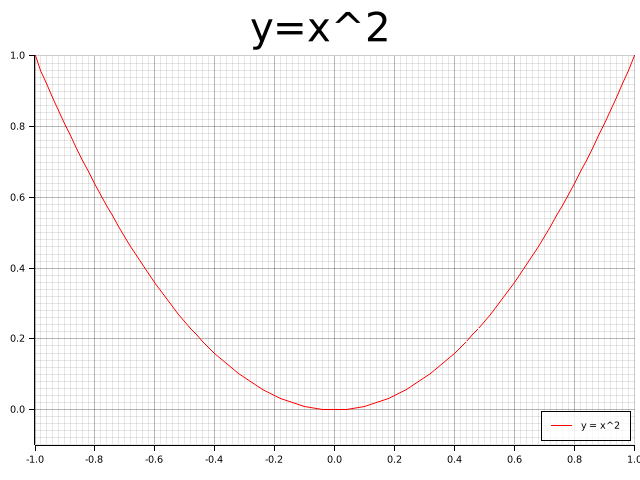
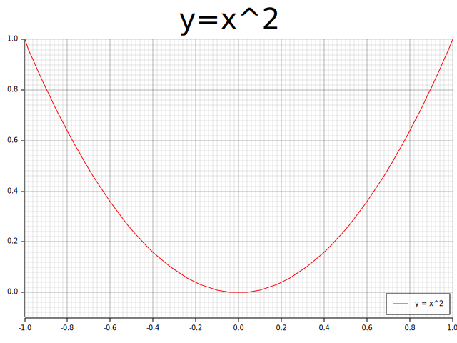
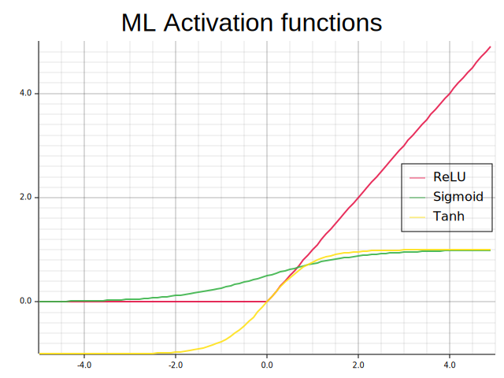
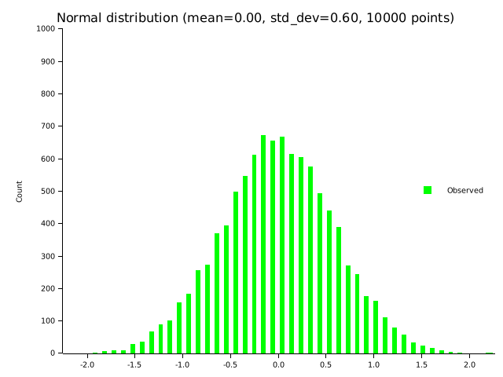
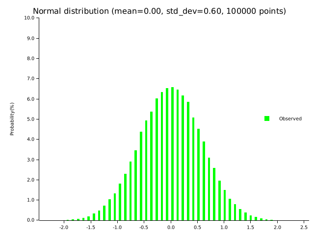
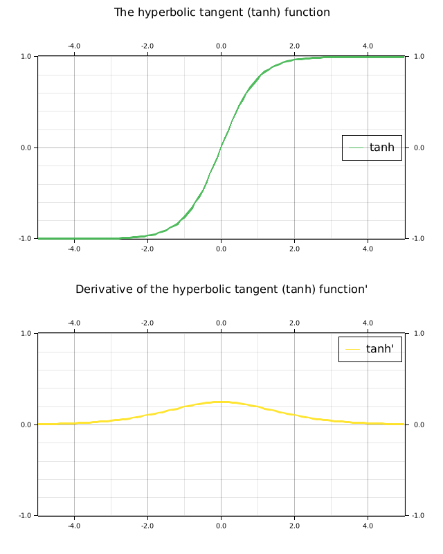
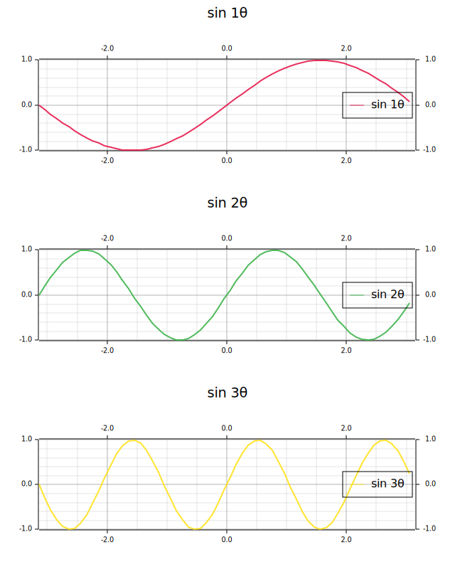
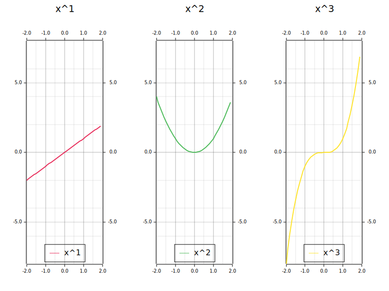
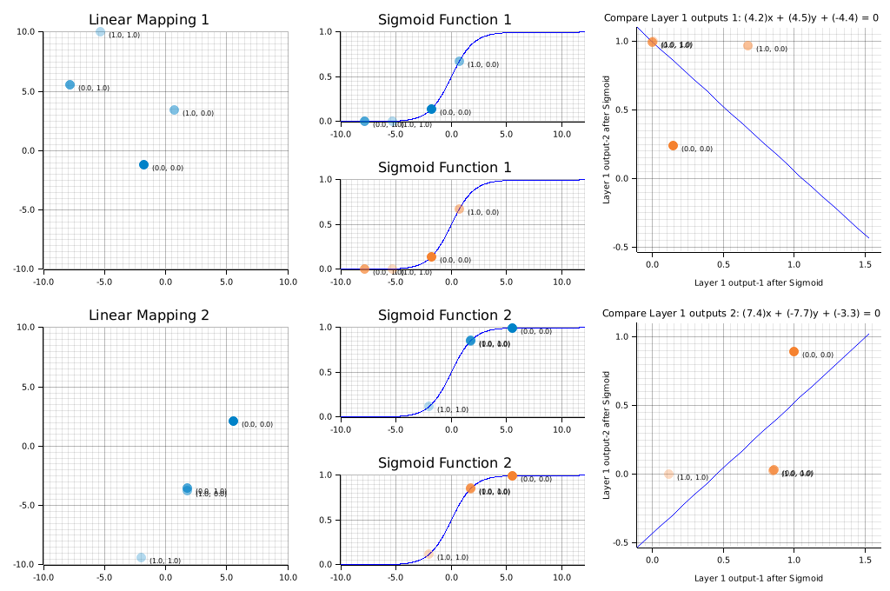

== Plotters Examples

* https://docs.rs/plotters/latest/plotters/[plotters - Rust^]
** https://docs.rs/plotters/latest/plotters/drawing/struct.DrawingArea.html[DrawingArea in plotters::drawing - Rust^]

=== Example 1: Plot x squared and output in png/svg format

[source,shell]
----
cargo run --bin plotters_x_squared_backend_png --release
cargo run --bin plotters_x_squared_backend_svg --release
----

.Output png image for example 1

.Output svg image for example 1

=== Example 2: Plot labels points

[source,shell]
----
cargo run --bin plotters_plot_labeled_points --release
----

.Output image for example 2
image::../images/plotters_plot_labeled_points.png[]

=== Example 3: ML activation functions

[source,shell]
----
cargo run --bin plotters_ml_activation --release
----

.ML activation functions

=== Example 4: Normal distribution

[source,shell]
----
cargo run --bin plotters_normal_dist_prob --release
cargo run --bin plotters_normal_dist_counts --release
----

=== Example 5-1: Multiple plots: split vertically two regions

[source,shell]
----
cargo run --bin plotters_multiple_plots_sigmoid --release
cargo run --bin plotters_multiple_plots_tanh --release
----

[source,math]
----
\begin{aligned}
\sigma(x) &= \frac{1}{1 + e^{-x}} \\
\sigma'(x) &= \sigma(x)\left(1 - \sigma(x)\right)
\end{aligned}
----

.Graph of the sigmoid function and its derivative function
image::../images/plotters_multiple_plots_sigmoid.png[]

[source,math]
----
\begin{aligned}
\tanh(x) &= \frac{e^x - e^{-x}}{e^x + e^{-x}} \\
\frac{d}{dx} \tanh(x) &= 1 - \tanh^2(x)
\end{aligned}
----

.Graph of the tanh function and its derivative function

=== Example 5-2: Multiple plots: split vertically or horizontally into three regions

[source,shell]
----
cargo run --bin plotters_multiple_plots_v3 --release
cargo run --bin plotters_multiple_plots_h3 --release
----

.split vertically into three regions

.split horizontally into three regions

=== Example 6: Linear mapping visualization for ML
Visualization of failures and successes of training XOR for two-layer neural network models. The top graph shows the result of a failed learning attempt, while the bottom graph shows the result of a successful learning attempt. The graphs visualize the results of Ax+b in layer 1 for input values (0,0), (0,1), (1,0), and (1,1), the result of applying the activation function, and the result of linear separation in layer 2.

When classifying XOR in a two-layer model, it is difficult to perform linear separation in the second layer if the first layer is transformed by a linear mapping. After moving points (0,1) and (1,0) to the same point by a linear mapping, (0,0), (1,1), and (0,1)=(1,0) are classified into different regions using a nonlinear curve derived from the activation function.

