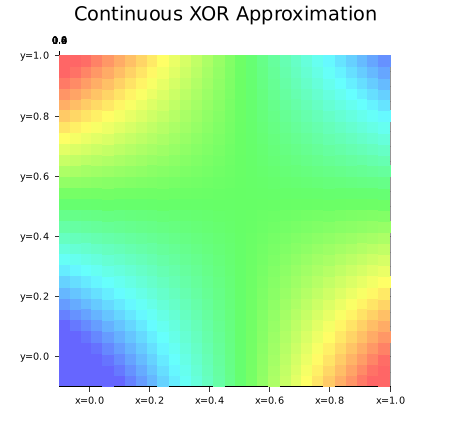
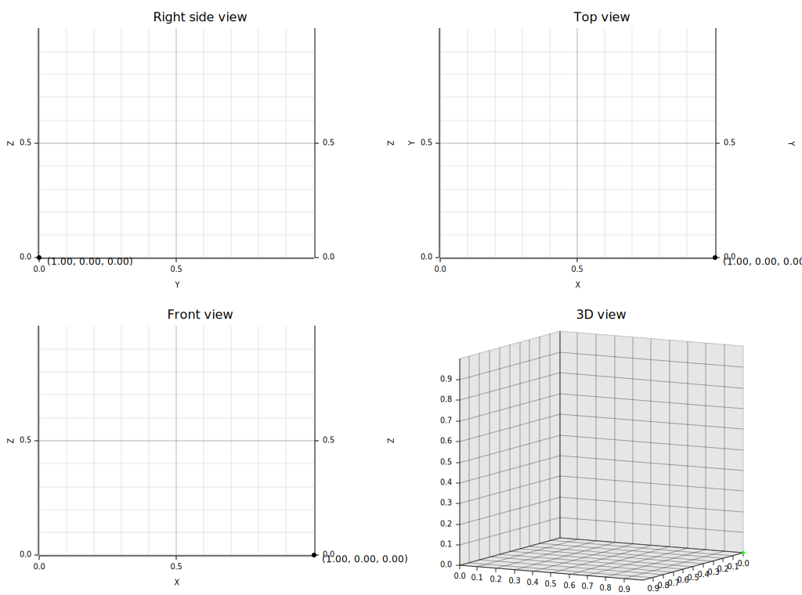
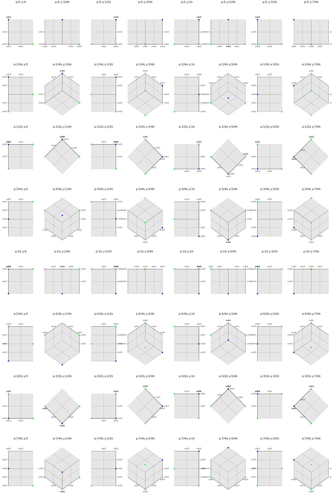
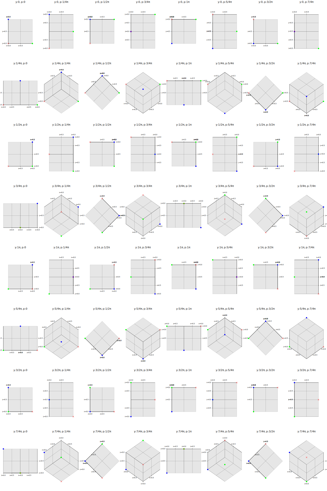

== Example 1: 3D Surface example

[source,shell]
.Run the example 1
----
cargo run --bin xor_3d_surface --release
----

image::images/xor_3d_surface.gif[]

== Example 1.1: Top view

[source,shell]
----
cargo run --bin xor_3d_surface_top_view --release
----

.Top view

== Example 2: Three-quarter view

[source,shell]
----
cargo run --bin three_quarter_view --release
----

.Three-quarter view

=== Example 3: Pitch and Yaw rotation

[source,shell]
----
cargo run --bin projection_3d --release
----

.Rotate with pitch, then rotate with yaw

.Rotate with yaw, then rotate with pitch

=== References

* https://docs.rs/ndarray/latest/ndarray/[ndarray - Rust^]
