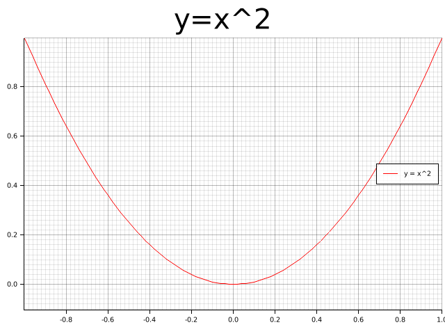

=== create a new binary project

. Let's create a new binary project called `plotters-x-squared`
+
[source,console]
----
$ cargo new plotters-x-squared --bin
     Created binary (application) `plotters-x-squared` package
----
+
[source,console]
----
$ cd plotters-x-squared/
----

=== Code

[source,rust]
.src/main.rs
----
use plotters::prelude::*;

fn main() -> Result<(), Box<dyn std::error::Error>> {
    let root = BitMapBackend::new("../images/plotters-x-squared.png", (640, 480)).into_drawing_area();
    root.fill(&WHITE)?;
    let mut chart = ChartBuilder::on(&root)
        .caption("y=x^2", ("sans-serif", 50).into_font())
        .margin(5)
        .x_label_area_size(30)
        .y_label_area_size(30)
        .build_cartesian_2d(-1f32..1f32, -0.1f32..1f32)?;

    chart.configure_mesh().draw()?;

    chart
        .draw_series(LineSeries::new(
            (-50..=50).map(|x| x as f32 / 50.0).map(|x| (x, x * x)),
            &RED,
        ))?
        .label("y = x^2")
        .legend(|(x, y)| PathElement::new(vec![(x, y), (x + 20, y)], &RED));

    chart
        .configure_series_labels()
        .background_style(&WHITE.mix(0.8))
        .border_style(&BLACK)
        .draw()?;

    Ok(())
}
----

=== Run

[source,console]
----
$ cargo run
    Finished dev [unoptimized + debuginfo] target(s) in 0.24s
     Running `target/debug/plotters-x-squared`
----

.Results

